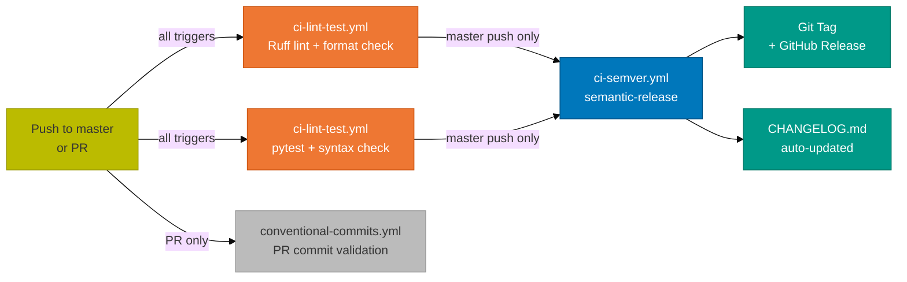
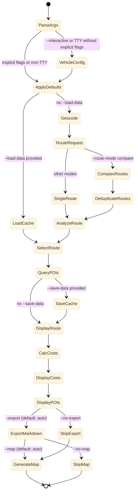

# Architecture -- Road Trip Planner

## Recap

The Road Trip Planner is a single-file Python CLI (`trip_planner.py`) that uses
only the Python standard library at runtime. It follows a two-phase architecture:
Phase 1 fetches all data from external APIs (geocoding, routing, POI discovery),
and Phase 2 renders outputs (console display, Markdown report, interactive HTML map).
A JSON cache bridge (`--save-data` / `--load-data`) sits between the phases, allowing
offline rendering of previously fetched data. The routing layer uses OpenRouteService
(ORS) as its primary provider with OSRM as a zero-config fallback, and optionally a
self-hosted OSRM instance for full exclude filter support. POI queries use the Overpass
API with a segmented polyline strategy to avoid timeouts on long routes.

---

## System Architecture Flowchart

```mermaid
%%{init: {'theme': 'base', 'themeVariables': {'fontSize': '15px'}}}%%
flowchart TB
    classDef primary fill:#0077BB,stroke:#005588,color:#fff
    classDef secondary fill:#EE7733,stroke:#CC5511,color:#fff
    classDef store fill:#009988,stroke:#007766,color:#fff
    classDef external fill:#AA3377,stroke:#882255,color:#fff
    classDef queue fill:#BBBB00,stroke:#999900,color:#333
    classDef error fill:#CC3311,stroke:#AA1100,color:#fff
    classDef neutral fill:#BBBBBB,stroke:#999999,color:#333

    MAIN["main()<br/>CLI entry + argparse"]:::primary

    subgraph Phase1["Phase 1: Data Fetching"]
        GEO["geocode()<br/>Nominatim lookup"]:::secondary
        ROUTE["route_request()<br/>Provider dispatch"]:::secondary
        ORS_FN["_route_ors()<br/>ORS GeoJSON API"]:::secondary
        OSRM_FN["_route_osrm()<br/>OSRM route API"]:::secondary
        ANALYZE["analyze_route()<br/>Toll/ferry/country detection"]:::secondary
        DEDUP["deduplicate_routes()<br/>1% distance threshold"]:::secondary
        POI["overpass_combined_query()<br/>Segmented per-type queries"]:::secondary
    end

    subgraph External["External APIs"]
        NOM["Nominatim<br/>nominatim.openstreetmap.org"]:::external
        ORS_API["OpenRouteService<br/>api.openrouteservice.org"]:::external
        OSRM_PUB["OSRM Public Demo<br/>router.project-osrm.org"]:::external
        OSRM_SELF["OSRM Self-Hosted<br/>localhost:5000"]:::external
        OVP["Overpass API<br/>overpass-api.de"]:::external
    end

    CACHE["JSON Cache<br/>--save-data / --load-data"]:::store

    subgraph Phase2["Phase 2: Rendering"]
        CONSOLE["Console Output<br/>ANSI-colored sections"]:::neutral
        COSTCALC["calc_costs()<br/>Fuel/toll/EV cost math"]:::secondary
        MDGEN["generate_markdown()<br/>Markdown report builder"]:::secondary
        MAPGEN["generate_map_html()<br/>Leaflet.js map builder"]:::secondary
        DISPLAY["display_poi_section()<br/>POI table formatting"]:::secondary
    end

    MD_FILE["trip_*.md"]:::store
    HTML_FILE["trip_*.html"]:::store

    MAIN --> GEO
    GEO --> NOM
    MAIN --> ROUTE
    ROUTE -->|"api_key set"| ORS_FN
    ROUTE -->|"no api_key"| OSRM_FN
    ORS_FN --> ORS_API
    OSRM_FN -->|"default"| OSRM_PUB
    OSRM_FN -->|"OSRM_URL set"| OSRM_SELF
    ROUTE --> DEDUP
    DEDUP --> ANALYZE
    MAIN --> POI
    POI --> OVP

    Phase1 -->|"--save-data"| CACHE
    CACHE -->|"--load-data"| Phase2

    MAIN --> COSTCALC
    MAIN --> CONSOLE
    MAIN --> DISPLAY
    MAIN --> MDGEN
    MAIN --> MAPGEN
    MDGEN --> MD_FILE
    MAPGEN --> HTML_FILE
```



---

## Two-Phase Architecture

The `main()` function is organized into two distinct phases, separated by an optional
JSON cache boundary.

**Phase 1 -- Data Fetching** makes all network calls:

1. `geocode()` each waypoint via Nominatim (1.1s rate limit between calls)
2. `route_request()` dispatches to `_route_ors()` or `_route_osrm()`
3. In compare mode: request additional toll-free, ferry-free, and scenic variants
4. `deduplicate_routes()` removes routes within 1% distance of each other
5. `analyze_route()` detects tolls, ferries, and countries traversed
6. Present route comparison table; user selects a route (interactive) or auto-select (piped)
7. `simplify_polyline()` downsamples route, then `overpass_combined_query()` finds POIs
8. `nearest_on_route()` computes haversine distance from each POI to closest route point

**Phase 2 -- Rendering** uses only in-memory data:

1. Display selected route details to console via ANSI-colored `section()`, `row()` helpers
2. `calc_costs()` computes fuel, EV, and toll costs
3. `display_poi_section()` prints POI tables per type
4. `generate_markdown()` builds a full Markdown trip report
5. `generate_map_html()` builds a standalone Leaflet.js HTML file

The `--save-data` flag serializes everything from Phase 1 to a JSON file. The
`--load-data` flag reads that file and skips Phase 1 entirely. Vehicle and cost
parameters (fuel type, consumption, price, currency) are not cached -- they can
be changed on reload.

---

## External API Inventory

| API | Endpoint | Function | Auth | Rate Limit |
|-----|----------|----------|------|------------|
| Nominatim | `nominatim.openstreetmap.org/search` | `geocode()` | None (User-Agent required) | 1 req/sec (enforced via `LAST_NOMINATIM` timer) |
| OSRM Public Demo | `router.project-osrm.org/route/v1/driving/` | `_route_osrm()` | None | Best-effort (demo server, no SLA) |
| OSRM Self-Hosted | Configurable via `OSRM_URL` env var | `_route_osrm()` | None | Unlimited (local Docker container) |
| OpenRouteService | `api.openrouteservice.org/v2/directions/driving-car/geojson` | `_route_ors()` | API key (Authorization header) | 40 req/min (free tier) |
| Overpass API | `overpass-api.de/api/interpreter` | `overpass_combined_query()` via `_run_overpass()` | None | ~2 req/10s recommended; 429/504 retried with exponential backoff |
| CartoDB Tiles | `{s}.basemaps.cartocdn.com/rastertiles/voyager/` | Used in `MAP_TEMPLATE` and `trip_planner.html` | None | Unlimited (CDN-served) |

---

## Routing Strategy: ORS vs OSRM Decision Tree

The routing layer is built around a dual-provider strategy implemented in
`route_request()`. The decision tree follows this logic:

```text
route_request(waypoints, api_key, avoid, osrm_url)
  |
  +-- api_key provided?
  |     YES --> _route_ors(waypoints, api_key, alternatives, avoid)
  |               Returns: toll data, ferry detection, avoid support, alternatives
  |
  |     NO --> is osrm_url self-hosted? (osrm_url != OSRM_DEFAULT_URL)
  |              |
  |              +-- YES --> _route_osrm(waypoints, exclude=mapped_avoid, base_url=osrm_url)
  |              |             Supports: exclude=toll,ferry,motorway
  |              |             Returns: ferry detection via step mode, no toll data
  |              |
  |              +-- NO --> _route_osrm(waypoints, base_url=OSRM_DEFAULT_URL)
  |                           No exclude support on demo server
  |                           Warning logged if avoid features were requested
```

**OpenRouteService (ORS) -- primary provider:**
- Requires a free API key (`--api-key` or `ORS_API_KEY` env var)
- Returns toll percentage via `extra_info: ["tollways", "waytypes"]`
- Supports `avoid_features` for toll-free (`tollways`), ferry-free (`ferries`), and scenic (`highways`)
- Returns ferry detection via step type 6
- Supports `alternative_routes` with configurable `target_count`, `share_factor`, `weight_factor`

**OSRM Public Demo -- zero-config fallback:**
- No API key required
- No toll data (`has_toll` always `False`, `toll_km` always `0`)
- No `exclude` parameter support on the demo server
- Ferry detection via step `mode: "ferry"`
- Supports `alternatives=true` for basic multi-route comparison

**OSRM Self-Hosted -- full-featured fallback:**
- Set up via `setup-osrm.sh` (Docker + Europe PBF, ~30 GB disk, ~30 min processing)
- Supports `exclude=toll,ferry,motorway` parameter
- Sub-100ms response times for European routes
- No toll percentage data (toll detection only via exclude support)
- ORS avoid features are mapped: `tollways` -> `toll`, `ferries` -> `ferry`, `highways` -> `motorway`

Both providers normalize their output to the same route dict structure with keys:
`distance`, `duration`, `geometry`, `ferry_segments`, `has_ferry`, `has_toll`,
`toll_km`, `toll_pct`, `major_roads`, `_source`.

---

## POI Query Architecture

Long-distance routes (e.g., Oxford to Rome, ~1500 km) produce polylines with
thousands of coordinate points. Sending a single Overpass `around` query for the
entire route causes server-side timeouts. The solution is a pipeline of four
functions.

**Step 1 -- Simplify:** `simplify_polyline()` downsamples the GeoJSON `[lon, lat]`
coordinate array to at most 150 points using uniform stride sampling. The first and
last points are always preserved.

**Step 2 -- Segment:** `_split_segments()` splits the simplified polyline into
overlapping segments of 15 points each (with 2-point overlap). Short routes (20
points or fewer) skip segmentation and use a single segment.

**Step 3 -- Query per type per segment:** `overpass_combined_query()` iterates over
each POI type (fuel, EV, hotels, rest) sequentially, then over each segment within
that type. Each combination produces one HTTP POST to `_run_overpass()`. A 2-second
delay between requests (`time.sleep(2.0)`) respects Overpass rate limits.

The Overpass query uses the `around` filter rather than `bbox`:

```text
[out:json][timeout:60];(
  node["amenity"="fuel"](around:5000,lat1,lon1,lat2,lon2,...);
  way["amenity"="fuel"](around:5000,lat1,lon1,lat2,lon2,...);
);out center 200;
```

**Step 4 -- Deduplicate:** Element IDs (`type + id`) are tracked in a `seen_ids` set
across all segments. Duplicate elements from overlapping segments are discarded. Each
POI type reports its total count and per-segment error count via the `progress_fn`
callback.

After all queries complete, `_classify_elements()` sorts the combined element list
into the four POI categories by examining OSM tags (`amenity`, `tourism`, `highway`).

---

## Toll Estimation Model

Toll cost estimation uses a heuristic model built from three data structures and
two functions.

**Data structures:**

`COUNTRY_BOXES` -- Bounding boxes for 7 European countries (FR, IT, ES, CH, AT, DE, GB)
as `(lat_min, lat_max, lon_min, lon_max)` tuples. Used by `_point_country()` to guess
which country a coordinate falls in.

`TOLL_RATES_EUR` -- Per-km toll rates on motorways in EUR. France (0.09), Italy (0.07),
Spain (0.10). Countries with vignette systems (CH, AT) or no car tolls (DE, GB) have
a rate of 0.00.

`VIGNETTE_COSTS_EUR` -- Flat fees for vignette countries. Switzerland: EUR 40 (mandatory
1-year vignette). Austria: EUR 10 (10-day vignette).

**Functions:**

`_point_country(lat, lon)` -- Iterates through `COUNTRY_BOXES` and returns the first
matching country code, or `None` for coordinates outside all boxes. Called by
`analyze_route()` on sampled route points (every Nth coordinate, where N = total
points / 50).

`estimate_toll_cost(analysis, currency)` -- Takes the analysis dict from
`analyze_route()` and computes total toll cost. Per-km rates are applied to
`toll_km_by_country`, then vignette fees are added for any traversed vignette
country. The result is converted from EUR using hardcoded rates (GBP: 0.86,
USD: 1.08).

**Toll-km distribution:** When ORS reports total toll-km and the route crosses
multiple toll-likely countries (rate > 0), the toll-km is split equally among those
countries. This is a simplification -- the actual split depends on which specific
road segments are toll roads.

---

## CI/CD Pipeline

The project uses a two-stage GitHub Actions pipeline orchestrated by `release.yml`.



**Stage 1: `ci-lint-test.yml`** (runs on all pushes and PRs to master)

- `ruff-lint` job: Python 3.13, installs ruff, runs `make lint` and `make format-check`
- `tests` job: Python 3.13, installs pytest + pytest-cov, runs `make check` (syntax) and `make test`

**Stage 2: `ci-semver.yml`** (runs on master push only, after lint-test passes)

- Requires `lint-test` job to succeed
- Skips if commit message contains `[skip ci]`
- Uses `semantic-release` with plugins: commit-analyzer, release-notes-generator,
  changelog, git, github
- Commits updated CHANGELOG.md with message `chore(release): update CHANGELOG to version X.Y.Z [skip ci]`
- Creates a git tag and GitHub release

**PR validation: `conventional-commits.yml`** (runs on PR open/sync/reopen/edit)

- Validates all non-merge commits against the conventional commits pattern
- Accepted types: `feat`, `fix`, `docs`, `style`, `refactor`, `perf`, `test`, `build`, `ci`, `chore`, `revert`
- Fails the check if any commit does not match

**Local pre-commit hooks** (`.pre-commit-config.yaml`):

9 hook sources providing: trailing-whitespace, end-of-file-fixer, check-yaml/json/toml,
check-added-large-files (500 KB max), no-commit-to-branch (blocks direct push to main),
ruff lint+format, gitleaks secret detection, bandit SAST, mypy type checking, shellcheck,
yamllint, markdownlint, and commitlint for commit-msg hooks.

---

## Design Decisions

### Why stdlib only (no pip dependencies)

The CLI uses only Python standard library modules (`argparse`, `json`, `urllib`,
`math`, `time`, `webbrowser`, `logging`, `pathlib`). This means the tool runs on
any system with Python 3.8+ installed -- no virtual environment, no `pip install`,
no dependency conflicts. For a single-file utility that users download and run
directly, zero runtime dependencies removes the biggest friction point. Dev
dependencies (ruff, pytest, bandit, mypy) are only needed for development and CI.

### Why Overpass around-filter instead of bbox

The `around` filter in Overpass queries POIs within a radius of a polyline:
`node["amenity"="fuel"](around:5000,lat1,lon1,lat2,lon2,...)`. A bounding box
(`bbox`) filter would cover the entire rectangular area between the route's extreme
coordinates. For a route from Oxford to Rome, a bbox would include all of France,
Switzerland, and northern Italy -- returning thousands of irrelevant POIs far from
the actual route. The `around` filter constrains results to a corridor along the
actual path, which is what drivers need.

### Why segmented queries with delays

Overpass is a shared public service with limited capacity. A single query covering
1500 km of route with 150 coordinate points and 8 tag filters (node + way for each
of 4 POI types) causes server-side timeouts. Splitting into per-type, per-segment
queries with 15 points each keeps individual query processing time under 60 seconds.
The 2-second inter-query delay respects the fair-use rate limit. The 4-retry
exponential backoff in `http_post()` handles the 429 (rate limited) and 504
(gateway timeout) responses that Overpass returns under load.

### Why two-phase fetch/render with JSON cache

European road trip queries take 30-60 seconds due to Nominatim rate limiting
(1 req/sec per waypoint), routing API latency, and multiple Overpass queries with
2-second delays. Users often want to re-generate reports with different vehicle
parameters (switching from diesel to electric, changing currency). The two-phase
design with `--save-data` / `--load-data` means they fetch once and render many
times. The cache stores the complete API response data including route geometries
and raw Overpass elements, so rendering is instant.

### Why ORS + OSRM dual routing

ORS provides the richest data (toll percentage, ferry detection, avoid features,
alternative routes) but requires a free API key signup. OSRM's public demo requires
nothing -- a user can run `python trip_planner.py --from Oxford --to Rome` and get
a working route immediately. The dual strategy gives the best out-of-box experience
(OSRM, no signup) with an upgrade path (ORS, full features). Self-hosted OSRM via
`setup-osrm.sh` provides a middle ground: no API key needed, full exclude support,
sub-100ms latency, but requires Docker and ~30 GB disk space.

---

## CLI Execution State Diagram



---

## Constants and Thresholds

| Constant | Value | Why This Value |
|----------|-------|----------------|
| `LAST_NOMINATIM` rate limit | 1.1 seconds between calls | Nominatim usage policy requires max 1 req/sec; 1.1s adds safety margin |
| `http_post` retries | 4 attempts | Overpass frequently returns 429/504 under load; 4 retries with exponential backoff covers ~2.5 minutes of waiting |
| `http_post` backoff | 5.0s base, doubling | First retry at 5s, second at 10s, third at 20s -- matches Overpass recovery time |
| `simplify_polyline` max_points | 150 | Enough resolution for 1500+ km routes (~10 km per point) while keeping total query size manageable |
| `POINTS_PER_SEGMENT` | 25 (constant) / 15 (actual usage) | Per-type queries use 15 points per segment; covers ~120 km per segment at ~8 km between points |
| `_split_segments` overlap | 2 points | Prevents POIs near segment boundaries from being missed; each overlap covers ~16 km |
| `deduplicate_routes` threshold | 1% distance | Routes within 1% of each other's total distance are effectively the same path |
| `_extract_major_roads` min distance | 5 km | Filters out minor streets, ramps, and short connector roads |
| Overpass inter-query delay | 2.0 seconds | Respects Overpass API fair-use rate limit of ~2 requests per 10 seconds |
| POI display limit (console) | 15 per type | Prevents console clutter while showing enough options for trip planning |
| POI display limit (Markdown) | 20 per type | Reports can be longer; 20 per type gives a usable reference list |
| POI display limit (HTML map) | 50 per type | Maps handle more markers; Leaflet renders 200+ markers without performance issues |
| `Overpass out center` limit | 200 | Limits total elements returned per query to prevent oversized responses |
| OSRM default URL | `https://router.project-osrm.org` | Official OSRM public demo; used as comparison baseline for self-hosted detection |

---

## Save/Load Cache Format

The cache is a single JSON file containing all data from Phase 1.

```json
{
  "waypoints": [
    {
      "lat": 51.752,
      "lon": -1.258,
      "display_name": "Oxford, Oxfordshire, England, United Kingdom",
      "short": "Oxford"
    }
  ],
  "route_options": [
    [
      "Fastest",
      {
        "distance": 1500000,
        "duration": 54000,
        "geometry": {"type": "LineString", "coordinates": [["..."]]},
        "has_toll": true,
        "toll_km": 342,
        "ferry_segments": [],
        "has_ferry": false,
        "major_roads": [{"name": "A34", "distance_km": 45}],
        "_source": "ors"
      },
      {
        "has_toll": true,
        "toll_km": 342,
        "toll_km_by_country": {"FR": 171, "IT": 171},
        "has_ferry": false,
        "ferry_segments": [],
        "countries": ["GB", "FR", "CH", "IT"],
        "is_channel_crossing": false
      }
    ]
  ],
  "selected_idx": 0,
  "pois": {
    "fuel": [{"type": "node", "id": 123, "lat": 48.8, "lon": 2.3, "tags": {"amenity": "fuel"}}],
    "ev": [],
    "hotels": [],
    "rest": []
  }
}
```

Sets (like `countries`) are converted to lists for JSON serialization.
Route analysis is stored alongside each route option as a precomputed triple.
The `selected_idx` records which route the user chose interactively.
Vehicle/cost parameters are intentionally excluded -- they can be changed on reload.

---

## Normalized Route Dict Structure

Both `_route_ors()` and `_route_osrm()` return lists of dicts with this structure:

```json
{
  "distance": 150000,
  "duration": 7200,
  "geometry": {"type": "LineString", "coordinates": [[-1.26, 51.75], [2.35, 48.86]]},
  "ferry_segments": [{"name": "Dover-Calais", "distance_km": 50, "duration_min": 90}],
  "has_ferry": true,
  "has_toll": true,
  "toll_km": 45.3,
  "toll_pct": 30.2,
  "major_roads": [{"name": "M40", "distance_km": 28.5}, {"name": "A26", "distance_km": 62.1}],
  "_source": "ors"
}
```

The `_source` field identifies the provider. OSRM routes always have `has_toll: false`
and `toll_km: 0` because the OSRM demo server does not provide toll data.
`major_roads` is extracted by `_extract_major_roads()` from route steps, keeping only
roads with 5+ km total distance and preserving order of appearance.
