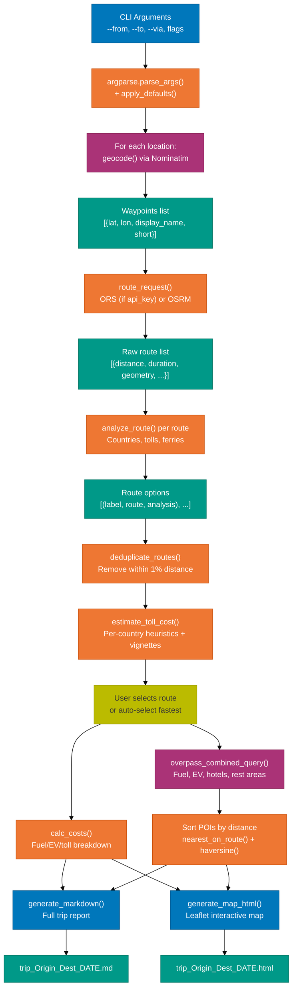
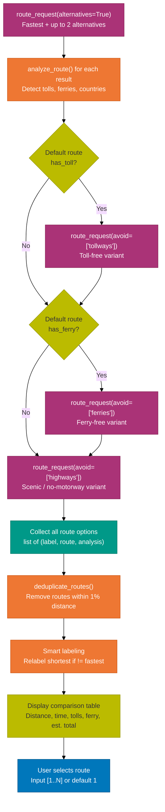
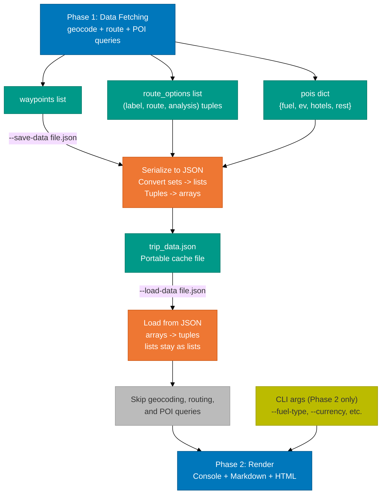
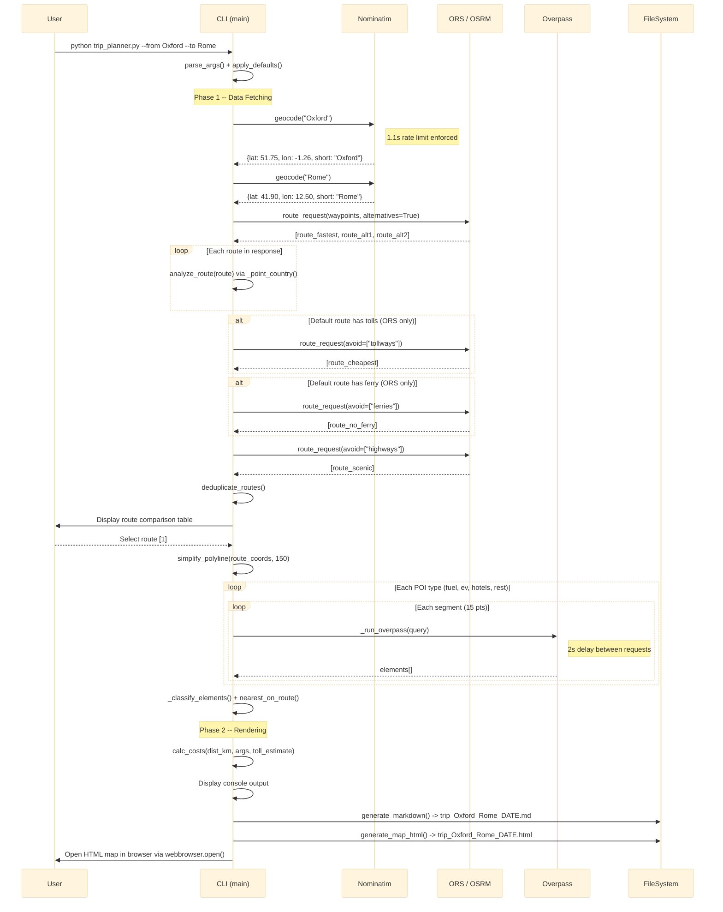

# Data Flows -- Road Trip Planner

## Recap

This document traces four end-to-end data flows through the Road Trip Planner
CLI: (1) the main trip planning pipeline from CLI arguments through geocoding,
routing, analysis, cost estimation, POI discovery, and output generation,
(2) the POI discovery pipeline that transforms raw route coordinates into
classified and sorted points of interest, (3) the multi-route comparison
pipeline that collects alternative routes and presents a selection interface,
and (4) the save/load cache flow that separates data fetching from rendering.
Each flow includes a Mermaid diagram, descriptions of data transformations,
failure modes, and error routing behavior.

---

## Detail

### Flow 1: Trip Planning (main flow)

The main flow starts with CLI argument parsing in `main()` and proceeds
through geocoding each location with `geocode()`, requesting routes via
`route_request()` (which dispatches to `_route_ors()` or `_route_osrm()`),
analyzing each route with `analyze_route()`, deduplicating near-identical
routes with `deduplicate_routes()`, estimating toll costs with
`estimate_toll_cost()`, prompting the user to select a route, calculating
trip costs with `calc_costs()`, querying POIs with
`overpass_combined_query()`, and finally producing outputs via
`generate_markdown()` and `generate_map_html()`.



**Data transformations at each step:**

| Step | Input | Output |
|------|-------|--------|
| `geocode()` | Place name string (e.g. "Oxford, UK") | `{lat, lon, display_name, short}` dict |
| `route_request()` | List of waypoint dicts + api_key | List of normalized route dicts |
| `analyze_route()` | Single normalized route dict | Analysis dict with countries, tolls, ferries |
| `deduplicate_routes()` | List of `(label, route, analysis)` tuples | Filtered list with near-duplicates removed |
| `estimate_toll_cost()` | Analysis dict + currency string | Float cost in target currency |
| `calc_costs()` | Distance km + CLI args + toll estimate | Cost breakdown dict: `{fuel_cost, ev_cost, toll, total, refills, sym}` |
| `overpass_combined_query()` | Simplified coords + skip types + radii | `{fuel: [], ev: [], hotels: [], rest: []}` |
| `generate_markdown()` | Waypoints, route, POIs, costs, args | Markdown string |
| `generate_map_html()` | Waypoints, geometry, POIs, title | HTML string with embedded Leaflet.js |

**Failure modes:**

- `geocode()` raises `ValueError` if Nominatim returns no results. `main()` catches this and calls `sys.exit(1)`.
- `route_request()` raises `RuntimeError` if the routing provider returns an error response. `main()` calls `sys.exit(1)`.
- `overpass_combined_query()` catches per-segment failures individually and logs them as warnings. If all segments for a POI type fail, the progress callback reports the error but execution continues with zero results for that type.
- `generate_markdown()` and `generate_map_html()` failures are caught in `main()` and printed, but do not halt the program.

---

### Flow 2: POI Discovery

The POI discovery pipeline starts with the full route geometry (often 2000+
coordinate pairs), simplifies it to at most 150 points with
`simplify_polyline()`, splits those into overlapping segments of 15 points
each via `_split_segments()`, then iterates over each POI type (fuel, ev,
hotels, rest) and each segment. For each combination, `_build_query()`
constructs an Overpass QL query and `_run_overpass()` executes it. Results
are deduplicated by element ID, then classified by OSM tags in
`_classify_elements()`. Finally, `nearest_on_route()` computes the
haversine distance from each POI to the nearest route point, and results
are sorted by ascending distance.

```mermaid
%%{init: {'theme': 'base', 'themeVariables': {'fontSize': '15px'}}}%%
flowchart TD
    classDef primary fill:#0077BB,stroke:#005588,color:#fff
    classDef secondary fill:#EE7733,stroke:#CC5511,color:#fff
    classDef store fill:#009988,stroke:#007766,color:#fff
    classDef external fill:#AA3377,stroke:#882255,color:#fff
    classDef queue fill:#BBBB00,stroke:#999900,color:#333
    classDef error fill:#CC3311,stroke:#AA1100,color:#fff
    classDef neutral fill:#BBBBBB,stroke:#999999,color:#333

    RAW_COORDS["Route geometry<br/>~2000+ [lon,lat] pairs"]:::store
    SIMPLIFY["simplify_polyline(route_coords, 150)<br/>Subsample to at most 150 points"]:::secondary
    SIMPLIFIED["Simplified polyline<br/>150 evenly-spaced [lon,lat] pairs"]:::store
    SPLIT["_split_segments(pts_per_seg=15)<br/>Overlapping segments, overlap=2"]:::secondary
    SEGMENTS["Segment list<br/>~12 segments of 15 points each"]:::store
    TYPE_LOOP["For each POI type:<br/>fuel, ev, hotels, rest"]:::queue
    SEG_LOOP["For each segment"]:::queue
    BUILD["_build_query(poly_str, specs, timeout)<br/>Overpass QL around-filter"]:::secondary
    RUN["_run_overpass(query, timeout=60)<br/>POST to overpass-api.de"]:::external
    DEDUP["Deduplicate by element ID<br/>seen_ids set tracks (type, id)"]:::secondary
    CLASSIFY["_classify_elements(elements)<br/>Sort into fuel/ev/hotels/rest by OSM tags"]:::secondary
    DISTANCE["nearest_on_route(simplified, lat, lon)<br/>Min haversine distance to any route point"]:::secondary
    SORT["Sort each category by _dist<br/>Ascending (nearest first)"]:::neutral
    OUTPUT["POI dict<br/>{fuel: [...], ev: [...], hotels: [...], rest: [...]}"]:::store

    RAW_COORDS --> SIMPLIFY
    SIMPLIFY --> SIMPLIFIED
    SIMPLIFIED --> SPLIT
    SPLIT --> SEGMENTS
    SEGMENTS --> TYPE_LOOP
    TYPE_LOOP --> SEG_LOOP
    SEG_LOOP --> BUILD
    BUILD --> RUN
    RUN --> DEDUP
    DEDUP --> CLASSIFY
    CLASSIFY --> DISTANCE
    DISTANCE --> SORT
    SORT --> OUTPUT
```



**Simplification example:**

A route from Oxford to Rome might return 3200 coordinate pairs from the
routing API. `simplify_polyline(coords, max_points=150)` subsamples to 150
evenly-spaced points by computing a step size of `(3200 - 1) / (150 - 1)
= 21.5` and picking `coords[round(i * 21.5)]` for i in 0..149.

After simplification, `_split_segments(simplified, pts_per_seg=15, overlap=2)`
produces approximately 12 segments. Each segment shares 2 points with the
previous one to avoid gaps in POI coverage at segment boundaries.

**POI type specifications passed to `_build_query()`:**

| Type | Tag Filters | Default Radius |
|------|-------------|----------------|
| fuel | `node["amenity"="fuel"]`, `way["amenity"="fuel"]` | 5000m |
| ev | `node["amenity"="charging_station"]`, `way["amenity"="charging_station"]` | 5000m |
| hotels | `node["tourism"="hotel"]`, `way["tourism"="hotel"]`, `node["tourism"="motel"]`, `way["tourism"="motel"]` | 10000m |
| rest | `node["highway"="rest_area"]`, `node["highway"="services"]` | 2000m |

**Rate limiting:**

A 2-second sleep is enforced between each Overpass request
(`time.sleep(2.0)` in the segment loop). The `http_post()` helper retries
on HTTP 429 and 504 with exponential backoff (base 5 seconds, up to 4
attempts).

**Classification rules in `_classify_elements()`:**

Elements are categorized by their OSM tags: `amenity=fuel` goes to fuel,
`amenity=charging_station` to ev, `tourism=hotel` or `tourism=motel` to
hotels, and `highway=rest_area` or `highway=services` to rest. Elements
that do not match any category are silently discarded.

**What can fail:**

- Individual segment queries may time out (Overpass 504) or be rate-limited (429). These trigger retry with exponential backoff.
- If all retries fail for a segment, that segment is logged as a warning and skipped. Other segments and POI types proceed.
- If all segments fail for a given POI type, the progress callback reports the error. That type will have zero results but the pipeline continues.
- Elements without valid coordinates (missing lat/lon) are filtered out during the distance computation step.

---

### Flow 3: Multi-Route Comparison

When `--route-mode compare` is active (the default for interactive sessions),
the planner requests multiple route variants and presents them for user
selection.



**Request strategy by `--route-mode`:**

| Mode | Requests Made | ORS API Key Required? |
|------|---------------|----------------------|
| `fastest` | 1 request (default route only) | No |
| `shortest` | 1 request with alternatives, then pick minimum distance | No |
| `compare` | 1 with alternatives + conditional toll-free + conditional ferry-free + scenic | Yes, for avoidance variants |
| `no-tolls` | 1 request with `avoid: ["tollways"]` | Yes |
| `no-ferries` | 1 request with `avoid: ["ferries"]` | Yes |
| `scenic` | 1 request with `avoid: ["highways"]` | Yes |

**Deduplication in `deduplicate_routes()`:**

Routes are compared by total distance. If two routes differ by less than 1%
in distance (`abs(dist_a - dist_b) / max(dist_a, dist_b) < 0.01`), the
later one is dropped. This prevents the comparison table from showing
near-identical routes from the ORS alternatives response.

**Smart labeling logic:**

After deduplication, the code finds the index of the shortest route (minimum
distance) and the index of the fastest route (minimum duration). If these
differ and the shortest route is currently labeled "Alternative N", it gets
relabeled to "Shortest".

**Error handling for comparison variants:**

Each additional routing request (toll-free, ferry-free, scenic) is wrapped
in its own try/except block. If a variant fails (e.g., no toll-free route
exists for the given waypoints), the exception is caught silently and the
variant is simply omitted from the comparison. The console prints "N/A"
with a brief reason.

**OSRM avoid feature limitation:**

The public OSRM demo server does not support the `exclude` parameter. When
using the public demo without an ORS API key, `route_request()` logs a
warning and falls back to fastest-only routing. Self-hosted OSRM instances
support `exclude=toll,ferry,motorway` via the `--osrm-url` flag.

---

### Flow 4: Save/Load Cache

The save/load mechanism creates a boundary between Phase 1 (data fetching)
and Phase 2 (rendering). This allows users to fetch data once with
`--save-data` and re-render multiple times with `--load-data` using
different vehicle parameters, currencies, or export options -- without
making any network requests.



**JSON structure of saved file:**

```json
{
  "waypoints": [
    {"lat": 51.752, "lon": -1.258, "display_name": "Oxford, ...", "short": "Oxford"}
  ],
  "route_options": [
    ["Fastest", {"distance": 1510234, "duration": 55800, "geometry": {...}, ...}, {"has_toll": true, ...}]
  ],
  "selected_idx": 0,
  "pois": {
    "fuel": [...],
    "ev": [...],
    "hotels": [...],
    "rest": [...]
  }
}
```

**Serialization transforms:**

- Python `set` values (the `countries` field in each analysis dict) are converted to `list` before JSON encoding.
- Python tuples in the `route_options` list become JSON arrays.

**On load:**

- JSON arrays representing route options are converted back to tuples via `tuple(x)`.
- The `countries` field remains a list (Python `in` operator works for both set and list membership tests).

**Parameters that can change between save and load:**

| Parameter | Effect on Load |
|-----------|---------------|
| `--fuel-type`, `--consumption`, `--fuel-price`, `--kwh`, `--kwh-price` | Cost recalculated in Phase 2 |
| `--currency` | Cost recalculated with new currency symbol and conversion rate |
| `--tolls` | Manual toll override applied during `calc_costs()` |
| `--export` / `--no-export` | Controls whether Markdown file is written |
| `--map` / `--no-map` | Controls whether HTML map is written |
| `--quiet` | Controls console verbosity of POI listing |
| `--from`, `--to`, `--via` | Ignored; waypoints come from cached data |
| `--route-mode` | Ignored; routes come from cached data |

**Error handling:**

- If the JSON file cannot be read or parsed, `main()` prints the error and calls `sys.exit(1)`.
- If `--save-data` fails during serialization or file write, the error is printed but execution continues.

---

### Sequence Diagram: Main Planning Flow

This sequence diagram shows the interaction between the user, the CLI, and
the external services during a typical trip planning session.



**Timing characteristics:**

The total time for a typical long-distance route (e.g., Oxford to Rome)
breaks down roughly as follows:

| Phase | Estimated Time | Bottleneck |
|-------|---------------|------------|
| Geocoding | 2-4 seconds | 1.1s Nominatim rate limit per location |
| Routing (compare mode) | 3-8 seconds | 4-5 sequential HTTP requests to ORS/OSRM |
| POI discovery | 30-90 seconds | 2s delay between Overpass requests, 4 types x ~12 segments |
| Rendering | < 1 second | Local computation and file I/O only |

POI discovery dominates total execution time. The `--no-fuel`, `--no-ev`,
`--no-hotels`, and `--no-rest` flags can be used to skip unneeded POI types
and reduce runtime proportionally.

---

### Error Propagation Summary

| Stage | Error Type | Behavior | Execution Continues? |
|-------|-----------|----------|---------------------|
| Geocoding | Location not found | `ValueError`, `sys.exit(1)` | No |
| Routing | HTTP error from provider | `RuntimeError`, `sys.exit(1)` | No |
| Compare variants | Toll-free/scenic unavailable | Exception caught, variant omitted | Yes |
| Overpass segment | HTTP 429 (rate limited) | Retry with exponential backoff, 4 attempts | Yes, after retry |
| Overpass segment | HTTP 504 (timeout) | Retry with exponential backoff, 4 attempts | Yes, after retry |
| Overpass segment | Other HTTP error | Warning logged, segment skipped | Yes |
| All segments fail for a type | Complete POI type failure | Progress callback reports error, 0 results | Yes |
| POI distance calc | Missing lat/lon | Element filtered out (no `_dist` field) | Yes |
| Markdown export | File write error | Caught and printed | Yes |
| Map generation | File write error | Caught and printed | Yes |
| Data save | Serialization error | Caught and printed | Yes |
| Data load | File read/parse error | `sys.exit(1)` | No |
