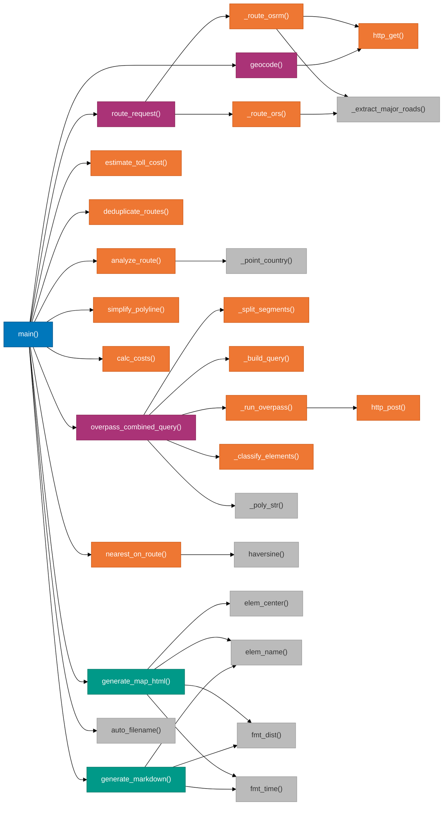

# Dependencies -- Road Trip Planner

## Recap

The Road Trip Planner has zero pip-installable runtime dependencies. The entire
CLI runs on the Python standard library: `argparse`, `json`, `logging`, `math`,
`os`, `sys`, `time`, `urllib`, `webbrowser`, `datetime`, and `pathlib`. External
runtime dependencies are limited to four HTTP APIs (Nominatim, ORS, OSRM,
Overpass) and a CDN-hosted JavaScript library (Leaflet.js 1.9.4) embedded in
generated HTML output. Dev tooling includes ruff for linting and formatting,
pytest for testing, semantic-release for automated versioning, commitlint for
conventional commits, and pre-commit hooks for code quality enforcement.

---

## Detail

### Function Call Dependency Graph

This diagram shows the internal call chain within `trip_planner.py`, radiating
outward from `main()` to the major subsystem functions and their internal
helpers.

---

### Standard Library Dependencies

Every import in `trip_planner.py` is from the Python standard library. No
`pip install` step is required.

| Module | Sub-modules Used | Purpose | Key Functions Using It |
|--------|-----------------|---------|----------------------|
| `argparse` | -- | CLI argument parsing (30+ flags) | `main()` |
| `json` | -- | Serialize/deserialize HTTP bodies and cache files | `http_get()`, `http_post()`, `_route_ors()`, `generate_map_html()`, `main()` |
| `logging` | -- | Debug and info messages to stderr | Global `log` instance, used throughout |
| `math` | -- | Trigonometric distance calculation, ceil for refill stops | `haversine()`, `calc_costs()` |
| `os` | -- | Read `ORS_API_KEY` and `OSRM_URL` environment variables | `main()` |
| `sys` | -- | Exit codes, stdin TTY detection, stderr for log output | `main()` |
| `time` | -- | Rate limiting delays and backoff timing | `geocode()`, `overpass_combined_query()`, `http_post()` |
| `urllib` | `urllib.request`, `urllib.parse`, `urllib.error` | HTTP GET/POST requests, URL encoding, error handling | `http_get()`, `http_post()`, `geocode()`, `_route_ors()`, `_run_overpass()` |
| `webbrowser` | -- | Auto-open generated HTML map in default browser | `main()` |
| `datetime` | `datetime` class | Timestamps in reports and auto-generated filenames | `generate_markdown()`, `auto_filename()` |
| `pathlib` | `Path` class | File writing with `Path.write_text()` | `main()` |

**Why stdlib-only?** The project targets environments where pip may not be
available or where users prefer not to manage virtual environments. A single
`.py` file with no install step is the simplest distribution model. The only
requirement is Python 3.8+.

---

### External API Dependencies

#### Nominatim (Geocoding)

| Attribute | Value |
|-----------|-------|
| Endpoint | `https://nominatim.openstreetmap.org/search` |
| HTTP Method | GET |
| Authentication | None (custom `User-Agent` header required by usage policy) |
| Rate Limit | 1 request per second (enforced by 1.1s sleep in `geocode()` via `LAST_NOMINATIM` global) |
| Response Format | JSON array of location objects |
| Called By | `geocode()` via `http_get()` |
| Query Parameters | `q` (search query), `format=json`, `limit=1`, `addressdetails=1` |
| Failure Mode | Empty results array raises `ValueError` |

#### OpenRouteService (Primary Routing)

| Attribute | Value |
|-----------|-------|
| Endpoint | `https://api.openrouteservice.org/v2/directions/driving-car/geojson` (constant `ORS_URL`) |
| HTTP Method | POST (JSON body) |
| Authentication | API key in `Authorization` header (from `--api-key` flag or `ORS_API_KEY` env var) |
| Rate Limit | 40 requests per minute on free tier |
| Response Format | GeoJSON FeatureCollection with route features |
| Called By | `_route_ors()` via direct `urllib.request.Request` |
| Body Fields | `coordinates`, `geometry`, `instructions`, `extra_info` (tollways, waytypes), `alternative_routes`, `options` (avoid features) |
| Failure Mode | Empty features array raises `RuntimeError` |

#### OSRM (Fallback Routing)

| Attribute | Value |
|-----------|-------|
| Default Endpoint | `https://router.project-osrm.org/route/v1/driving/{coords}` (constant `OSRM_DEFAULT_URL`) |
| Self-Hosted Endpoint | Configurable via `--osrm-url` flag or `OSRM_URL` env var |
| HTTP Method | GET |
| Authentication | None |
| Rate Limit | Best-effort on public demo server (not intended for production); no limit on self-hosted |
| Response Format | JSON with `routes` array |
| Called By | `_route_osrm()` via `http_get()` |
| Query Parameters | `overview=full`, `geometries=geojson`, `steps=true`, `alternatives=true`, `exclude` (self-hosted only) |
| Failure Mode | Non-"Ok" `code` field raises `RuntimeError` |

#### Overpass API (POI Discovery)

| Attribute | Value |
|-----------|-------|
| Endpoint | `https://overpass-api.de/api/interpreter` (constant `OVERPASS_URL`) |
| HTTP Method | POST (form-encoded body with `data` parameter) |
| Authentication | None |
| Rate Limit | ~2 requests per 10 seconds (fair use policy; enforced by 2s sleep between requests) |
| Response Format | JSON with `elements` array |
| Called By | `_run_overpass()` via `http_post()` |
| Retry Logic | 4 attempts with exponential backoff on HTTP 429 (rate limited) and 504 (gateway timeout) |
| Failure Mode | Segment-level failures are logged and skipped; pipeline continues |

#### Leaflet.js / CartoDB (Map Rendering -- CDN)

| Attribute | Value |
|-----------|-------|
| Leaflet CDN | `https://unpkg.com/leaflet@1.9.4/` (CSS + JS) |
| Tile Provider | `https://{s}.basemaps.cartocdn.com/rastertiles/voyager/{z}/{x}/{y}@2x.png` |
| Usage | Embedded in HTML output generated by `generate_map_html()` via `MAP_TEMPLATE` |
| Authentication | None |
| Note | The generated HTML requires internet access to load tiles and Leaflet library at viewing time |

---

### Shared Constants

These module-level constants are used across multiple functions and define
the core configuration of the planner.

#### `COUNTRY_BOXES`

Bounding boxes for country detection, used by `_point_country()` which is
called from `analyze_route()`.

| Country | Lat Min | Lat Max | Lon Min | Lon Max |
|---------|---------|---------|---------|---------|
| FR | 42.3 | 51.1 | -5.1 | 8.2 |
| IT | 36.6 | 47.1 | 6.6 | 18.5 |
| ES | 36.0 | 43.8 | -9.3 | 3.3 |
| CH | 45.8 | 47.8 | 5.9 | 10.5 |
| AT | 46.4 | 49.0 | 9.5 | 17.2 |
| DE | 47.3 | 55.1 | 5.9 | 15.0 |
| GB | 49.9 | 58.7 | -8.2 | 1.8 |

#### `TOLL_RATES_EUR`

Per-kilometer toll rates in EUR for motorways, used by `estimate_toll_cost()`.

| Country | Rate (EUR/km) | Rationale |
|---------|---------------|-----------|
| FR | 0.09 | Average French autoroute toll rate |
| IT | 0.07 | Average Italian autostrada rate |
| ES | 0.10 | Spanish autopista rates (tend higher per km) |
| CH | 0.00 | Vignette system, no per-km charge |
| AT | 0.00 | Vignette system for cars |
| DE | 0.00 | No general car tolls on Autobahn |
| GB | 0.00 | No general motorway tolls |

The default rate for unrecognized countries is `TOLL_RATE_DEFAULT = 0.08`.

Vignette flat fees are stored separately in `VIGNETTE_COSTS_EUR`: Switzerland
40.0 EUR (mandatory 1-year vignette) and Austria 10.0 EUR (10-day vignette).

#### `POI_TYPES`

Configuration dict mapping POI category keys to display metadata, used by
`display_poi_section()`, `generate_markdown()`, and `generate_map_html()`.

| Key | Title | Detail Function | Column 2 Header |
|-----|-------|-----------------|-----------------|
| `"fuel"` | Fuel Stations | `fuel_detail()` | Details |
| `"ev"` | EV Charging Points | `ev_detail()` | Sockets |
| `"hotels"` | Hotels Along Route | `hotel_detail()` | Type |
| `"rest"` | Rest Areas / Services | `rest_detail()` | Type |

#### `VEHICLE_PRESETS`

Predefined vehicle configurations for interactive mode, used by
`prompt_vehicle_config()`.

| Key | Name | Fuel Type | L/100km | Tank (L) | Price/L | Currency |
|-----|------|-----------|---------|----------|---------|----------|
| "1" | Compact Diesel | diesel | 5.5 | 55 | 1.45 | GBP |
| "2" | Family Diesel SUV | diesel | 7.5 | 65 | 1.45 | GBP |
| "3" | Compact Petrol | petrol | 6.0 | 50 | 1.55 | GBP |
| "4" | Family Petrol SUV | petrol | 9.0 | 70 | 1.55 | GBP |
| "5" | EV (Tesla-like) | electric | N/A | N/A | N/A | GBP |
| "6" | Plug-in Hybrid | hybrid | 5.0 | 45 | 1.50 | GBP |

#### `MAP_TEMPLATE`

An HTML template string (approximately 160 lines) containing the full Leaflet
map page. It uses Python `.format()` placeholders for `{title}`,
`{all_routes_json}`, `{waypoints_json}`, and `{pois_json}`.
`generate_map_html()` calls `MAP_TEMPLATE.format(...)` to produce the final
HTML output.

---

### Dev Dependencies

#### Python Dev Tools

| Tool | Version Pinned | Purpose | Invoked By |
|------|---------------|---------|------------|
| ruff | v0.9.10 (pre-commit) | Linting (E, W, F, I rules) and formatting | `make lint`, `make format`, pre-commit hook |
| pytest | (not pinned, via pip) | Test runner | `make test`, `make test-cov` |
| pytest-cov | (not pinned, via pip) | Coverage reporting with 50% minimum threshold | `make test-cov` |
| bandit | v1.8.3 (pre-commit) | Security static analysis (SAST) for Python | pre-commit hook |
| mypy | v1.15.0 (pre-commit) | Type checking with `--ignore-missing-imports` | pre-commit hook |
| yamllint | v1.35.1 (pre-commit) | YAML file linting | pre-commit hook |
| shellcheck | v0.10.0.1 (pre-commit) | Shell script linting for `setup-osrm.sh` | pre-commit hook |
| markdownlint-cli | v0.43.0 (pre-commit) | Markdown linting (several rules disabled via args) | pre-commit hook |
| gitleaks | v8.18.4 (pre-commit) | Secret detection in committed files | pre-commit hook |

#### Node.js Dev Tools

| Package | Version | Purpose |
|---------|---------|---------|
| `semantic-release` | ^25.0.3 | Automated versioning and GitHub releases |
| `@semantic-release/commit-analyzer` | ^13.0.1 | Analyze conventional commits for version bumps |
| `@semantic-release/release-notes-generator` | ^14.1.0 | Generate release notes from commits |
| `@semantic-release/changelog` | ^6.0.3 | Update CHANGELOG.md on release |
| `@semantic-release/git` | ^10.0.1 | Commit version bumps and changelog |
| `@semantic-release/github` | ^12.0.6 | Create GitHub releases |
| `@commitlint/cli` | ^20.4.4 | Validate commit messages match conventional format |
| `@commitlint/config-conventional` | ^20.4.4 | Conventional commits preset config |

#### Pre-commit Hook Pipeline

The `.pre-commit-config.yaml` defines the following hooks that run on every
commit:

| Hook | Stage | What It Does |
|------|-------|-------------|
| trailing-whitespace | pre-commit | Remove trailing whitespace |
| end-of-file-fixer | pre-commit | Ensure files end with newline |
| check-yaml, check-json, check-toml | pre-commit | Validate config file syntax |
| check-added-large-files (500KB) | pre-commit | Block files over 500KB |
| check-merge-conflict | pre-commit | Detect merge conflict markers |
| detect-private-key | pre-commit | Block accidental private key commits |
| check-case-conflict | pre-commit | Detect filename case collisions |
| mixed-line-ending (LF) | pre-commit | Enforce Unix line endings |
| no-commit-to-branch (main) | pre-commit | Block direct commits to main |
| ruff (lint + fix) | pre-commit | Auto-fix linting issues |
| ruff-format | pre-commit | Apply consistent formatting |
| gitleaks | pre-commit | Scan for secrets |
| bandit | pre-commit | Python security analysis |
| mypy | pre-commit | Type checking |
| shellcheck | pre-commit | Shell script linting |
| yamllint | pre-commit | YAML linting |
| markdownlint | pre-commit | Markdown linting |
| commitlint | commit-msg | Validate conventional commit format |

#### GitHub Actions CI Workflows

| Workflow | Trigger | Steps |
|----------|---------|-------|
| `ci-lint-test.yml` | Push / PR | Checkout, setup Python, ruff check, pytest |
| `ci-semver.yml` | Push / PR | Validate commit messages with commitlint |
| `conventional-commits.yml` | Push / PR | Enforce conventional commit format |
| `release.yml` | Push to main | Run semantic-release for automated versioning |

---

### Configuration Files

| File | Format | Purpose |
|------|--------|---------|
| `pyproject.toml` | TOML | Project metadata, ruff config (line-length=100, target py38), pytest paths, coverage settings, bandit exclusions, mypy config |
| `package.json` | JSON | Node.js dev dependencies for semantic-release and commitlint |
| `.pre-commit-config.yaml` | YAML | Pre-commit hook definitions with pinned versions |
| `.releaserc.yml` | YAML | Semantic-release configuration |
| `Makefile` | Make | Developer shortcuts: `lint`, `format`, `test`, `test-cov`, `run`, `check`, `clean`, `pre-commit-install` |
| `.gitignore` | Text | Ignore patterns for caches, generated files |

---

### Dependency Constraints and Design Decisions

**No concurrent.futures:** The project does not use `concurrent.futures`
despite the potential for parallelizing Overpass queries. This is a deliberate
choice to respect the Overpass API fair-use rate limit of approximately 2
requests per 10 seconds. Sequential requests with 2-second delays are simpler
and avoid triggering 429 responses.

**No requests library:** The project uses `urllib.request` directly instead of
the popular `requests` library. This keeps the dependency count at zero and
allows the script to run on any Python 3.8+ installation without pip.

**No API key required for basic usage:** The planner falls back to the public
OSRM demo server when no ORS API key is configured. This means basic route
planning works out of the box, while the ORS API key unlocks toll avoidance,
ferry avoidance, and scenic routing features.

**Hardcoded currency rates:** Currency conversion between EUR, GBP, and USD
uses hardcoded approximate rates (`GBP: 0.86`, `USD: 1.08`) in
`estimate_toll_cost()`. This avoids adding an exchange rate API dependency
at the cost of potentially stale rates.
