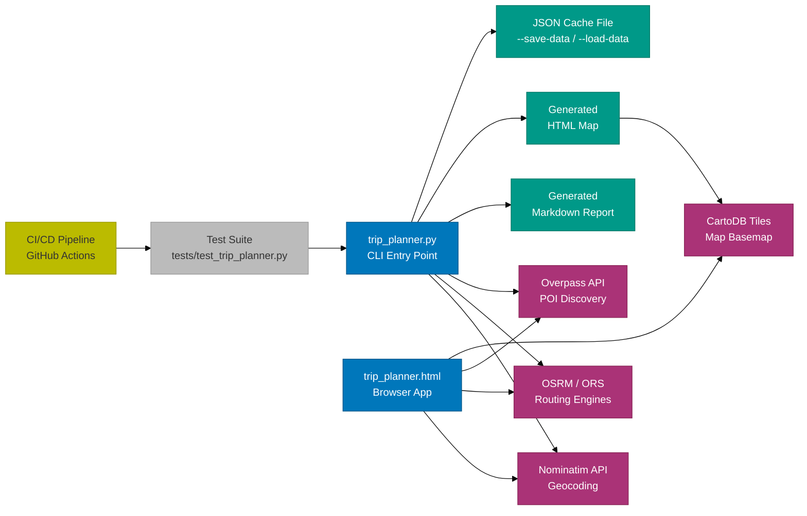

# Trip Planner -- Documentation Index

## Recap

This is the central navigation hub for the Road Trip Planner project documentation.
The project is a single-file Python CLI (`trip_planner.py`, ~1905 lines) that plans
European road trips using free OpenStreetMap-based APIs. It geocodes locations,
computes multiple route alternatives, discovers points of interest along the route,
estimates costs (fuel, tolls, ferries), and produces a Markdown report plus an
interactive HTML map. A companion browser app (`trip_planner.html`) provides a
standalone web interface with the same mapping capabilities. The project uses GitHub
Actions for CI/CD with semantic versioning and conventional commits.

---

## System-Level Flowchart



---

## Documentation Map

| # | Document | Purpose | Key Topics |
|---|----------|---------|------------|
| 1 | [INDEX.md](INDEX.md) | This file -- navigation hub and system overview | System flowchart, doc map, recent changes |
| 2 | [ARCHITECTURE.md](ARCHITECTURE.md) | System architecture and design decisions | Two-phase design, API inventory, toll model, routing strategy, CI/CD pipeline |
| 3 | [DATA_FLOWS.md](DATA_FLOWS.md) | End-to-end data flow diagrams | Trip planning flow, POI query flow, route comparison flow |
| 4 | [DEPENDENCIES.md](DEPENDENCIES.md) | Component dependency graph | Stdlib imports, external APIs, shared constants, call chains |

---

## How to Navigate This Documentation

**Starting fresh?** Read documents in order (1 through 4). The index gives the
system-level picture, the architecture doc explains the two-phase design and all
external integrations, data flows show how information moves through the system,
and dependencies clarify the internal call graph.

**Debugging a routing issue?** Start with [ARCHITECTURE.md](ARCHITECTURE.md) for
the ORS vs OSRM decision tree and the normalized route dict structure. Then check
[DATA_FLOWS.md](DATA_FLOWS.md) for the routing sequence diagram.

**Adding a new feature?** Read [ARCHITECTURE.md](ARCHITECTURE.md) to understand the
two-phase fetch/render separation, then [DEPENDENCIES.md](DEPENDENCIES.md) to see
what existing functions you can reuse. Pay attention to the design decisions section
in the architecture doc -- it explains the "why" behind stdlib-only, segmented
queries, and dual routing.

**Setting up CI/CD locally?** The CI/CD pipeline section in
[ARCHITECTURE.md](ARCHITECTURE.md) covers the `release.yml` orchestrator and its
reusable workflows. Use `make pre-commit-install` to set up local hooks.

**Looking for a specific function?** The [DEPENDENCIES.md](DEPENDENCIES.md) doc
maps every call chain and function relationship. The architecture doc's two-phase
diagram shows where each function fits in the execution flow.

**Want to run the self-hosted OSRM server?** The routing strategy section in
[ARCHITECTURE.md](ARCHITECTURE.md) covers the decision tree and references
`setup-osrm.sh` for Docker-based setup.

---

## Project Structure

```text
trip-planner/
  trip_planner.py          # Main CLI tool (~1905 lines, stdlib-only)
  trip_planner.html         # Browser-based companion app (standalone web UI)
  setup-osrm.sh             # Docker setup for self-hosted OSRM server
  tests/
    test_trip_planner.py    # Unit tests covering utility, routing, toll, POI logic
  .github/
    workflows/
      release.yml           # Orchestrator pipeline (lint-test -> semver)
      ci-lint-test.yml      # Lint + test reusable workflow
      ci-semver.yml         # Semantic release reusable workflow
      conventional-commits.yml  # PR commit message validation
  Makefile                  # Dev task runner (lint, format, test, run, clean)
  pyproject.toml            # Python project config (ruff, pytest, bandit, mypy, coverage)
  .pre-commit-config.yaml   # 9 hook sources covering lint, format, security, types, commits
  .releaserc.yml            # semantic-release config (changelog, git, github plugins)
  package.json              # Node dependencies for semantic-release tooling
  docs/                     # This documentation set
```

---

## Technology Stack

| Layer | Technology | Purpose |
|-------|-----------|---------|
| Language | Python 3.8+ (stdlib only) | Zero pip dependencies at runtime |
| Geocoding | Nominatim API | Convert place names to lat/lon coordinates |
| Routing (primary) | OpenRouteService (ORS) | Full-featured routing with toll/ferry detection and avoidance |
| Routing (fallback) | OSRM (public demo or self-hosted) | Zero-config fallback; self-hosted supports exclude filters |
| POI Discovery | Overpass API | Query fuel stations, EV chargers, hotels, rest areas along route |
| Map Tiles | CartoDB Voyager | Basemap tiles for generated HTML maps and browser app |
| Map Rendering | Leaflet.js 1.9.4 | Interactive map with route polylines, markers, and controls |
| Linting | Ruff v0.9.10 | Python lint + format (line-length 100, select E/W/F/I) |
| Testing | pytest + pytest-cov | Unit tests with 50% minimum coverage threshold |
| Security | Bandit, Gitleaks | SAST for Python and secret detection in commits |
| Type Checking | mypy v1.15.0 | Static type analysis with relaxed settings |
| Shell Lint | ShellCheck v0.10 | Linting for `setup-osrm.sh` |
| CI/CD | GitHub Actions | Automated lint, test, and release on push/PR to master |
| Versioning | semantic-release | Automated semver from conventional commit messages |
| Commit Enforcement | commitlint + conventional-commits workflow | Validates commit message format on PRs and commit-msg hook |

---

## Recent Changes

This section tracks notable changes to the project. Update this list when
significant modifications are made.

| Date | Change | Impact |
|------|--------|--------|
| -- | Initial documentation set created | Four docs covering architecture, data flows, dependencies, and this index |
| -- | Multi-route comparison mode | Users can compare fastest, shortest, toll-free, scenic, and ferry-free routes |
| -- | ORS + OSRM dual routing | ORS as primary provider with toll/ferry data; OSRM as zero-config fallback |
| -- | Self-hosted OSRM support | `setup-osrm.sh` enables Docker-based OSRM with exclude filters (toll, ferry, motorway) |
| -- | Save/load data cache | `--save-data` / `--load-data` enables offline rendering without re-fetching API data |
| -- | Interactive vehicle config | Vehicle presets and interactive prompts with 6 preset types including EV and hybrid |
| -- | Toll estimation model | Per-country toll rates (`TOLL_RATES_EUR`), vignette costs, bounding-box country detection |
| -- | Major road extraction | `_extract_major_roads()` pulls significant road names (>5 km) from route steps |
| -- | Browser companion app | `trip_planner.html` provides a standalone web UI with sidebar controls and Leaflet map |
| -- | CI/CD pipeline | `release.yml` orchestrator with lint-test and semantic versioning stages |

---

## Conventions Used in These Docs

- **Function names** are written in backticks: `route_request()`, `analyze_route()`
- **File paths** are relative to the repository root unless stated otherwise
- **Mermaid diagrams** use a consistent color scheme across all documents (see below)
- **Constants and thresholds** include explanations for why each value was chosen
- **Example JSON** is provided for API request/response structures where applicable
- **No banned words** are used: the terms "comprehensive", "robust", "seamless",
  "leverage", "synergy", "deep dive", and "holistic" do not appear in these docs

---

## Color Legend for Diagrams

All Mermaid diagrams in this documentation set use a consistent color palette:

| Color | classDef | Hex | Usage |
|-------|----------|-----|-------|
| Blue | primary | #0077BB | Core application components (CLI, browser app) |
| Orange | secondary | #EE7733 | Business logic modules (geocoding, routing, POI, cost) |
| Teal | store | #009988 | Files, caches, outputs (JSON, Markdown, HTML) |
| Purple | external | #AA3377 | Third-party APIs and services (Nominatim, OSRM, ORS, Overpass) |
| Yellow | queue | #BBBB00 | Events, triggers, pipeline stages (CI/CD) |
| Red | error | #CC3311 | Error states and failure paths |
| Grey | neutral | #BBBBBB | Supporting/utility components (tests, helpers) |

Every Mermaid diagram in this doc set begins with the `%%{init: ...}%%` directive
and includes the full `classDef` block for consistent rendering across different
Mermaid renderers (GitHub, VS Code, Mermaid Live Editor).

---

## Quick Reference

**Run the CLI:**

```bash
python trip_planner.py --from "Oxford, UK" --to "Rome, Italy"
python trip_planner.py --from "Oxford" --to "Rome" --via "Lyon" --via "Milan"
python trip_planner.py --from "Oxford" --to "Rome" -i  # interactive vehicle setup
```

**Run tests:**

```bash
make test          # pytest -v
make test-cov      # pytest with coverage (50% minimum)
make lint          # ruff check
make format-check  # ruff format --check
```

**Set up self-hosted OSRM:**

```bash
./setup-osrm.sh           # download + process + start (~30 min, ~30 GB)
export OSRM_URL=http://localhost:5000
python trip_planner.py --from "Oxford" --to "Rome" --route-mode compare
```

**Save and reload data:**

```bash
python trip_planner.py --from "Oxford" --to "Rome" --save-data trip.json
python trip_planner.py --from "Oxford" --to "Rome" --load-data trip.json --fuel-type electric
```
