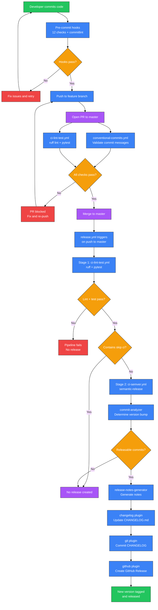

# CI/CD Pipeline

## Recap

The trip-planner project uses a CI/CD pipeline built on GitHub Actions, semantic-release, and pre-commit hooks. Conventional Commits enforce structured commit messages that drive automatic version bumping. Pre-commit hooks catch linting, formatting, security, and type issues locally before code reaches the remote. On every pull request, GitHub Actions validates commit messages and runs ruff + pytest. On merge to master, semantic-release analyzes commits since the last tag, determines the next version, creates a GitHub release, and updates `CHANGELOG.md`. The pipeline has two stages: lint-test (all triggers) and semver (master push only), orchestrated by `release.yml`.

Connections: `.pre-commit-config.yaml` drives local hooks (ruff, gitleaks, bandit, mypy, shellcheck, yamllint, markdownlint, commitlint). `conventional-commits.yml` validates PR commits. `ci-lint-test.yml` runs ruff + pytest. `ci-semver.yml` runs semantic-release. `release.yml` chains lint-test into semver. `.releaserc.yml` configures the semantic-release plugin pipeline. `package.json` pins the Node.js dependencies for semantic-release and commitlint.

---

## Detail

### Purpose

Automated quality gates and release management for a single-file Python CLI project. The pipeline solves three problems:

1. **Local quality enforcement**: Pre-commit hooks run 12 checks on every commit attempt, catching issues before they reach the remote repository.
2. **PR validation**: GitHub Actions workflows validate that all commits follow Conventional Commits format and that the code passes linting and tests.
3. **Automated releases**: On merge to master, semantic-release reads commit messages, calculates the next semver version, tags the release, generates release notes, and updates the changelog -- all without manual intervention.

### Business Logic

#### Developer Workflow (Local)

When a developer runs `git commit`:

1. **Pre-commit hooks** fire (installed via `pre-commit install` and `pre-commit install --hook-type commit-msg`):
   - **File hygiene**: trailing whitespace removal, end-of-file fixer, YAML/JSON/TOML validation, large file check (>500KB), merge conflict markers, private key detection, case conflict check, LF line endings
   - **No direct commits to main**: `no-commit-to-branch --branch main` blocks accidental pushes
   - **Python linting**: `ruff --fix --exit-non-zero-on-fix` (auto-fixes and fails if fixes were needed)
   - **Python formatting**: `ruff-format` (enforces consistent style)
   - **Secret detection**: `gitleaks` scans for leaked credentials
   - **Security analysis**: `bandit -c pyproject.toml` (SAST for Python, skips B101/B110/B113/B404/B603/B607)
   - **Type checking**: `mypy --ignore-missing-imports`
   - **Shell linting**: `shellcheck` on `.sh` files
   - **YAML linting**: `yamllint` with relaxed config, 120-char line limit
   - **Markdown linting**: `markdownlint` with several disabled rules (MD013, MD024, MD033, MD036, MD038, MD040, MD041, MD051, MD060)
   - **Commit message**: `commitlint --edit` (runs at `commit-msg` stage, validates Conventional Commits format via `@commitlint/config-conventional`)

2. If any hook fails, the commit is rejected. The developer fixes the issue and retries.

#### Pull Request Workflow

When a PR is opened or updated against master:

1. **`conventional-commits.yml`** triggers on `pull_request` events (opened, synchronize, reopened, edited):
   - Checks out the repo with full history (`fetch-depth: 0`)
   - Iterates over all commits between `origin/{base_ref}` and the PR head SHA
   - Skips merge commits (more than 2 parents)
   - Validates each commit subject against the regex pattern:
     `^(feat|fix|docs|style|refactor|perf|test|build|ci|chore|revert)(\(.+\))?!?:\s.+`
   - If any non-conventional commit is found, the job fails with guidance on the expected format

2. **`release.yml`** triggers on `pull_request` to master:
   - Calls `ci-lint-test.yml` (reusable workflow)
   - The `semver` job is skipped (only runs on push to master)

3. **`ci-lint-test.yml`** runs two parallel jobs:
   - **ruff-lint**: Sets up Python 3.13, installs ruff, runs `make lint` and `make format-check`
   - **tests**: Sets up Python 3.13, installs pytest + pytest-cov, runs `make check` (syntax check) and `make test`

#### Master Merge Workflow

When a PR is merged to master (push event):

1. **`release.yml`** triggers on push to master:
   - **Stage 1**: Calls `ci-lint-test.yml` (same lint + test as PR)
   - **Stage 2**: If lint-test passes, and the commit message does not contain `[skip ci]`, calls `ci-semver.yml`

2. **`ci-semver.yml`** runs semantic-release:
   - Checks out with full history (`fetch-depth: 0`) using `GH_TOKEN` (PAT, not default `GITHUB_TOKEN`)
   - Sets up Node.js 22 with npm cache
   - Runs `npm ci` to install dependencies from `package-lock.json`
   - Configures git remote URL with PAT for authenticated push
   - Runs `npx semantic-release` with `GITHUB_TOKEN` set to the PAT
   - Captures the release tag via `git describe --tags --abbrev=0` and outputs it

3. **Semantic-release** executes its plugin pipeline (configured in `.releaserc.yml`):
   - `@semantic-release/commit-analyzer`: Reads all commits since the last tag, applies Conventional Commits rules to determine the release type (patch, minor, major)
   - `@semantic-release/release-notes-generator`: Generates release notes from commit messages
   - `@semantic-release/changelog`: Writes release notes to `CHANGELOG.md`
   - `@semantic-release/git`: Commits the updated `CHANGELOG.md` with message `chore(release): update CHANGELOG to version ${nextRelease.version} [skip ci]`
   - `@semantic-release/github`: Creates a GitHub Release with the generated notes

   Release branches: `master`, `next`, `beta` (prerelease), `alpha` (prerelease), and maintenance branches matching `+([0-9])?(.{+([0-9]),x}).x`.

### Inputs and Outputs

#### Conventional Commit Messages and Version Impact

| Commit Message | Version Bump | Example Result |
|---------------|-------------|---------------|
| `fix(routing): handle empty OSRM response` | PATCH | 1.0.0 -> 1.0.1 |
| `fix: correct haversine calculation` | PATCH | 1.0.1 -> 1.0.2 |
| `feat(poi): add campsite POI type` | MINOR | 1.0.2 -> 1.1.0 |
| `feat: support GPX export` | MINOR | 1.1.0 -> 1.2.0 |
| `feat!: change CLI argument format` | MAJOR | 1.2.0 -> 2.0.0 |
| `BREAKING CHANGE:` in commit body | MAJOR | (same as above) |
| `docs: update README examples` | No release | (no version change) |
| `chore: update dev dependencies` | No release | (no version change) |
| `ci: fix workflow permissions` | No release | (no version change) |
| `refactor: extract route analysis` | No release | (no version change) |
| `test: add ferry detection tests` | No release | (no version change) |

#### `.releaserc.yml` Plugin Pipeline Effect

The semantic-release plugin chain produces these artifacts on a successful release:

1. A new git tag (format: `${version}`, e.g., `1.2.0` -- no `v` prefix, per `tagFormat` config)
2. Updated `CHANGELOG.md` in the repository (committed and pushed)
3. A GitHub Release with auto-generated release notes
4. A `[skip ci]` commit to prevent the changelog update from triggering another pipeline run

### Internal Structure

| File | Lines | Purpose |
|------|-------|---------|
| `.github/workflows/release.yml` | 41 | Orchestrator: chains lint-test -> semver on push to master; runs lint-test only on PR |
| `.github/workflows/ci-lint-test.yml` | 38 | Reusable workflow: ruff lint + format check, syntax check, pytest |
| `.github/workflows/ci-semver.yml` | 54 | Reusable workflow: runs semantic-release with PAT authentication |
| `.github/workflows/conventional-commits.yml` | 45 | PR check: validates all commit messages against Conventional Commits regex |
| `.pre-commit-config.yaml` | 81 | 12 hook definitions across 9 repos plus 1 local hook |
| `.releaserc.yml` | 23 | Semantic-release config: 5 plugins, tag format, release branches |
| `package.json` | 23 | Node.js project config: semantic-release + commitlint dependencies |
| `pyproject.toml` | 35 | Python project config: ruff, pytest, coverage, bandit, mypy settings |
| `Makefile` | 62 | Build targets: lint, format, test, test-cov, run, check, clean, pre-commit-install |

### Key Configurations

#### 1. `release.yml` Orchestrator Job Chain

The orchestrator defines two jobs with a dependency chain:

- `lint-test`: Runs on all triggers (push to master and PR to master). Calls `ci-lint-test.yml` as a reusable workflow.
- `semver`: Runs only on push to master, only if the commit message does not contain `[skip ci]`. Depends on `lint-test` (via `needs: [lint-test]`). Calls `ci-semver.yml` with the `GH_TOKEN` secret. Requires elevated permissions: `contents: write`, `issues: write`, `pull-requests: write`.

The `[skip ci]` check prevents infinite loops: semantic-release commits the updated CHANGELOG with `[skip ci]` in the message, so that commit does not trigger another pipeline run.

#### 2. `.releaserc.yml` Plugin Pipeline

Five plugins execute in order:

1. **commit-analyzer**: Parses commit messages to determine release type. Uses Angular preset (default for Conventional Commits). `feat` -> minor, `fix` -> minor, `!` or `BREAKING CHANGE` -> major.
2. **release-notes-generator**: Groups commits by type into human-readable release notes.
3. **changelog**: Prepends release notes to `CHANGELOG.md`.
4. **git**: Stages `CHANGELOG.md`, commits with `chore(release): update CHANGELOG to version ${nextRelease.version} [skip ci]`, and pushes. Uses PAT-authenticated remote URL.
5. **github**: Creates a GitHub Release object with the tag and release notes.

Tag format is `${version}` (no `v` prefix). Release branches include `master`, `next`, and prerelease channels `beta` and `alpha`.

#### 3. `.pre-commit-config.yaml` Hook List

| Hook | Source | Stage | Purpose |
|------|--------|-------|---------|
| `trailing-whitespace` | pre-commit-hooks v5.0.0 | pre-commit | Remove trailing whitespace |
| `end-of-file-fixer` | pre-commit-hooks v5.0.0 | pre-commit | Ensure files end with newline |
| `check-yaml` | pre-commit-hooks v5.0.0 | pre-commit | Validate YAML syntax |
| `check-json` | pre-commit-hooks v5.0.0 | pre-commit | Validate JSON syntax |
| `check-toml` | pre-commit-hooks v5.0.0 | pre-commit | Validate TOML syntax |
| `check-added-large-files` | pre-commit-hooks v5.0.0 | pre-commit | Block files > 500KB |
| `check-merge-conflict` | pre-commit-hooks v5.0.0 | pre-commit | Detect unresolved merge markers |
| `detect-private-key` | pre-commit-hooks v5.0.0 | pre-commit | Block private key files |
| `check-case-conflict` | pre-commit-hooks v5.0.0 | pre-commit | Detect filename case conflicts |
| `mixed-line-ending` | pre-commit-hooks v5.0.0 | pre-commit | Enforce LF line endings |
| `no-commit-to-branch` | pre-commit-hooks v5.0.0 | pre-commit | Block direct commits to main |
| `ruff` | ruff-pre-commit v0.9.10 | pre-commit | Lint Python with auto-fix |
| `ruff-format` | ruff-pre-commit v0.9.10 | pre-commit | Format Python code |
| `gitleaks` | gitleaks v8.18.4 | pre-commit | Scan for leaked secrets |
| `bandit` | PyCQA/bandit 1.8.3 | pre-commit | Python security analysis |
| `mypy` | mirrors-mypy v1.15.0 | pre-commit | Python type checking |
| `shellcheck` | shellcheck-py v0.10.0.1 | pre-commit | Shell script linting |
| `yamllint` | yamllint v1.35.1 | pre-commit | YAML linting (relaxed, 120-char) |
| `markdownlint` | markdownlint-cli v0.43.0 | pre-commit | Markdown linting |
| `commitlint` | local | commit-msg | Validate Conventional Commits |

#### 4. Makefile Targets

| Target | Command | Purpose |
|--------|---------|---------|
| `lint` | `ruff check trip_planner.py` | Lint Python code |
| `format` | `ruff format trip_planner.py` | Format Python code |
| `format-check` | `ruff format --check trip_planner.py` | Check formatting without modifying |
| `test` | `python3 -m pytest tests/ -v --tb=short` | Run tests |
| `test-cov` | `python3 -m pytest tests/ -v --cov=. --cov-report=term-missing --cov-fail-under=50` | Run tests with coverage |
| `run` | `python3 trip_planner.py $(ARGS)` | Run the CLI (pass ARGS) |
| `check` | `python3 -c "import py_compile; ..."` | Syntax check only |
| `clean` | `rm -rf __pycache__ .pytest_cache ...` | Remove generated files |
| `pre-commit-install` | `pre-commit install` + `--hook-type commit-msg` | Install all pre-commit hooks |
| `pre-commit-run` | `pre-commit run --all-files` | Run all hooks on all files |
| `help` | grep/awk on Makefile | Print available targets |

### Connections

```
Developer workstation:
  git commit -> pre-commit hooks -> ruff, gitleaks, bandit, mypy,
                                    shellcheck, yamllint, markdownlint,
                                    commitlint (commit-msg stage)

GitHub (PR):
  conventional-commits.yml -> validates commit messages (regex)
  release.yml -> ci-lint-test.yml -> ruff lint + format-check, pytest

GitHub (master push):
  release.yml -> ci-lint-test.yml -> ci-semver.yml
                                      -> semantic-release
                                         -> commit-analyzer
                                         -> release-notes-generator
                                         -> changelog (CHANGELOG.md)
                                         -> git (commit + push)
                                         -> github (GitHub Release)
```

### Diagrams

#### Pipeline Workflow



### Constants and Thresholds

| Constant | Value | Source | Purpose |
|----------|-------|--------|---------|
| Coverage threshold | 50% | `pyproject.toml` `[tool.coverage.report] fail_under` | Minimum test coverage to pass CI; set conservatively for a CLI tool with many I/O-dependent paths |
| Ruff line-length | 100 | `pyproject.toml` `[tool.ruff] line-length` | Maximum line length for Python code; E501 (line too long) is ignored in lint rules, so this applies to formatting only |
| Ruff target version | py38 | `pyproject.toml` `[tool.ruff] target-version` | Python 3.8 compatibility target |
| Ruff lint rules | E, W, F, I | `pyproject.toml` `[tool.ruff.lint] select` | Pycodestyle errors (E), warnings (W), Pyflakes (F), isort (I) |
| Large file limit | 500 KB | `.pre-commit-config.yaml` `check-added-large-files --maxkb=500` | Prevents accidentally committing large binary files |
| YAML line length | 120 | `.pre-commit-config.yaml` yamllint args | Relaxed YAML line length for workflow files |
| Node.js version | 22 | `ci-semver.yml` setup-node | LTS version for running semantic-release |
| Python version | 3.13 | `ci-lint-test.yml` setup-python | Latest stable Python for CI |
| Bandit skips | B101, B110, B113, B404, B603, B607 | `pyproject.toml` `[tool.bandit] skips` | B101=assert, B110=pass-in-except, B113=request-without-timeout, B404/B603/B607=subprocess-related; all are false positives for this project |
| Fetch depth | 0 | `ci-semver.yml`, `conventional-commits.yml` | Full git history needed for semantic-release to analyze commits and for conventional-commits to check all PR commits |
| Tag format | `${version}` | `.releaserc.yml` `tagFormat` | No `v` prefix on version tags (e.g., `1.2.0` not `v1.2.0`) |

### Error Handling

**Pre-commit hook fails**

When any pre-commit hook fails, the commit is rejected. The developer sees the hook output in the terminal indicating which hook failed and why. Auto-fixable hooks (like `ruff --fix`, `trailing-whitespace`, `end-of-file-fixer`, `mixed-line-ending`) modify the files in place -- the developer needs to `git add` the fixed files and retry the commit. Non-auto-fixable hooks (like `gitleaks`, `bandit`, `mypy`) require manual intervention.

**Conventional commit check fails**

The `conventional-commits.yml` workflow iterates every non-merge commit in the PR and checks against the regex pattern. If any commit fails validation, the entire job fails and the PR cannot be merged (assuming branch protection rules require this check). The error output lists each non-conforming commit with its SHA and message, plus a link to the Conventional Commits specification. The developer must either amend the commit messages (interactive rebase) or squash-merge with a conforming title.

**Semantic-release finds no releasable commits**

When all commits since the last tag are types that do not trigger a release (`docs`, `chore`, `ci`, `refactor`, `test`, `style`, `build`), the commit-analyzer plugin determines no version bump is needed. Semantic-release exits cleanly with no error. No tag is created, no GitHub Release is published, and `CHANGELOG.md` is not modified. The `capture_tag` step outputs the existing latest tag (or "none" if no tags exist). This is normal behavior, not a failure.

**Lint or test failure on master**

If `ci-lint-test.yml` fails on a push to master (ruff lint fails or pytest fails), the `semver` job is skipped entirely due to the `needs: [lint-test]` dependency. No release is created. This should be rare since the same checks run on the PR, but can happen if branch protection is not enforced or if a merge conflict introduces issues.

**GH_TOKEN authentication failure**

The `ci-semver.yml` workflow uses a Personal Access Token (`GH_TOKEN` secret) rather than the default `GITHUB_TOKEN`. This is required because semantic-release needs to push commits (the CHANGELOG update) and create releases, and the default token cannot trigger subsequent workflows. If the PAT is expired or missing, the checkout step or the semantic-release push step will fail with an authentication error.

---

## Change Log

| Date | Git Ref | What Changed |
|------|---------|-------------|
| | | Initial documentation |

---

## References

- [docs/trip-planner-cli.md](/docs/trip-planner-cli.md) -- main CLI component documentation
- [docs/ARCHITECTURE.md](/docs/ARCHITECTURE.md) -- project architecture overview
- [Conventional Commits](https://www.conventionalcommits.org/) -- commit message specification
- [semantic-release](https://semantic-release.gitbook.io/) -- automated versioning and changelog
- [pre-commit](https://pre-commit.com/) -- Git hook framework
- [Ruff](https://docs.astral.sh/ruff/) -- Python linter and formatter
- [commitlint](https://commitlint.js.org/) -- commit message linter
