# Trip Planner CLI

## Recap

`trip_planner.py` is a single-file Python CLI that plans European road trips using free OpenStreetMap services. It geocodes locations via Nominatim, fetches routes from OSRM or OpenRouteService, detects tolls and ferries, discovers fuel/EV/hotel/rest POIs along the route via Overpass, estimates costs, and exports a markdown report plus an interactive HTML map. The tool supports multi-route comparison (fastest, toll-free, scenic, ferry-free) similar to ViaMichelin. It has zero pip dependencies -- the entire tool uses Python standard library only (`urllib`, `json`, `argparse`, `math`, `pathlib`). The project includes 38 unit tests covering utility functions, cost calculations, route analysis, and deduplication logic. A self-hosted OSRM option via Docker (`setup-osrm.sh`) unlocks toll/ferry/motorway exclusion that the public OSRM demo server does not support.

Connections: Nominatim for geocoding, OSRM or ORS for routing, Overpass API for POI queries, CartoDB for map tiles in the HTML export. Output files are standalone markdown and HTML (Leaflet-based map). A JSON cache file (`--save-data` / `--load-data`) enables render-only mode without API calls.

---

## Detail

### Purpose

Road trip planner CLI for European driving. It solves several problems in a single tool:

- **Route planning** with toll and ferry detection across multiple countries
- **Multi-route comparison** (ViaMichelin-style): fastest, alternatives, toll-free, scenic, ferry-free
- **POI discovery** along the route: fuel stations, EV charging points, hotels, rest areas
- **Cost estimation** for fuel, electricity, tolls, and vignettes with per-country heuristics
- **Report generation**: structured markdown report and interactive HTML map with route switching

The tool targets UK-to-Europe driving trips but works for any route covered by OpenStreetMap data. Zero pip dependencies means it runs on any system with Python 3.8+.

### Business Logic

Detailed walkthrough of `main()` (starts at line ~1272 in `trip_planner.py`):

#### Step 1: Parse CLI Arguments

`argparse.ArgumentParser` defines 30+ arguments organized into six groups:

- **Route**: `--from`, `--to`, `--via` (repeatable)
- **API config**: `--api-key`, `--osrm-url`, `--overpass-url`
- **Vehicle**: `--fuel-type`, `--consumption`/`--efficiency`, `--tank`, `--fuel-price`, `--kwh`, `--kwh-price`, `--tolls`, `--currency`
- **Interactive**: `-i`/`--interactive`
- **Route mode**: `--route-mode` (fastest, shortest, no-tolls, no-ferries, scenic, compare)
- **POI control**: `--no-fuel`, `--no-ev`, `--no-hotels`, `--no-rest`, `--poi-radius`
- **Output**: `--export`, `--no-export`, `--map`, `--no-map`, `--quiet`, `--save-data`, `--load-data`, `-v`/`--verbose`

All vehicle arguments default to `None` so the tool can detect whether the user explicitly set them. If no vehicle flags are given and stdin is a TTY, the tool enters interactive vehicle configuration.

#### Step 2: Logging Setup

`-v` sets `logging.INFO`, `-vv` sets `logging.DEBUG`. Logs go to stderr. The logger name is `trip_planner`. All HTTP requests and Overpass query sizes are logged at DEBUG level.

#### Step 3: Interactive Vehicle Config

`prompt_vehicle_config()` presents 6 presets defined in `VEHICLE_PRESETS`:

| Key | Preset Name | Fuel Type | L/100km | Tank (L) | Price/L |
|-----|------------|-----------|---------|----------|---------|
| 1 | Compact Diesel | diesel | 5.5 | 55 | 1.45 |
| 2 | Family Diesel SUV | diesel | 7.5 | 65 | 1.45 |
| 3 | Compact Petrol | petrol | 6.0 | 50 | 1.55 |
| 4 | Family Petrol SUV | petrol | 9.0 | 70 | 1.55 |
| 5 | EV (Tesla-like) | electric | N/A | N/A | N/A |
| 6 | Plug-in Hybrid | hybrid | 5.0 | 45 | 1.50 |

Option `[0]` opens fully custom input. EV and hybrid presets prompt for `kWh/100km` and price per kWh. `apply_defaults()` fills any remaining `None` values after interactive config completes or is skipped.

#### Step 4: Data Fetching (Phase 1)

This entire phase is skipped when `--load-data` is provided.

**4a. Geocoding via Nominatim**

`geocode()` calls the Nominatim search API with a 1.1-second throttle between requests (Nominatim usage policy). Returns `lat`, `lon`, `display_name`, and a `short` name (first comma-separated part of the display name). Failure raises `ValueError` and exits.

**4b. Route Requests**

`route_request()` dispatches to `_route_ors()` (if `--api-key` is set) or `_route_osrm()`. Both return a normalized list of route dicts with fields: `distance`, `duration`, `geometry`, `ferry_segments`, `has_ferry`, `has_toll`, `toll_km`, `toll_pct`, `major_roads`, `_source`.

- `_route_ors()`: Posts JSON to `https://api.openrouteservice.org/v2/directions/driving-car/geojson`. Requests `extra_info: ["tollways", "waytypes"]` for toll detection. Detects ferries from step type 6. Extracts toll percentage from extras and computes `toll_km`.
- `_route_osrm()`: GET request to OSRM route endpoint with `overview=full&geometries=geojson&steps=true`. Detects ferries from step `mode == "ferry"`. Cannot detect tolls (demo server limitation). Self-hosted OSRM supports `exclude=toll,ferry,motorway` via query parameter.

**4c. Multi-route Comparison**

When `--route-mode compare` (the default in TTY mode):

1. Request fastest route + alternatives (`alternatives=true`)
2. If ORS key is available and the default route has tolls: request toll-free variant (`avoid=["tollways"]`)
3. If the default route has ferries: request ferry-free variant (`avoid=["ferries"]`)
4. Request scenic variant (`avoid=["highways"]`)

Each variant failure is caught silently (prints "N/A") -- the tool continues with whatever routes succeeded.

**4d. Route Analysis**

`analyze_route()` processes each normalized route dict:

- Samples every Nth geometry coordinate (N = total_points / 50) to detect countries via `_point_country()` bounding-box lookup
- Distributes `toll_km` proportionally across toll-likely countries
- Detects Channel crossings (ferry + both GB and FR in traversed countries)
- Returns: `has_toll`, `toll_km`, `toll_km_by_country`, `has_ferry`, `ferry_segments`, `countries`, `is_channel_crossing`

**4e. Deduplication**

`deduplicate_routes()` removes routes whose total distance is within 1% of an already-seen route. After dedup, the tool relabels the shortest-distance route as "Shortest" if it differs from the fastest.

**4f. Comparison Table and Selection**

In compare mode with multiple routes, the tool displays a numbered list with distance, time, toll estimate, ferry info, and total cost per route. If stdin is a TTY, it prompts the user to select a route.

**4g. POI Queries**

`overpass_combined_query()` handles POI discovery:

1. `simplify_polyline()` reduces route geometry to at most 150 points (uniform subsampling)
2. `_split_segments()` divides into overlapping segments of 15 points each (overlap of 2 points) for short routes (<=20 points), a single segment is used
3. For each POI type (fuel, ev, hotels, rest), for each segment: build an Overpass `around` query with type-specific radius, execute via `_run_overpass()`, deduplicate by element ID
4. 2-second delay between requests for Overpass rate limiting
5. `_classify_elements()` sorts raw Overpass elements into category buckets by OSM tags

After POI query, distances from the route are computed via `nearest_on_route()` (haversine to closest simplified route point) and results are sorted by distance.

#### Step 5: Rendering (Phase 2)

Works identically whether data was fetched or loaded from cache:

- Display selected route details (distance, time, major roads, toll/ferry info)
- `calc_costs()` computes fuel/EV/toll costs. Manual `--tolls` overrides auto-estimate
- Display cost breakdown
- Display POI sections (up to 15 items each, truncated names)
- Display summary

#### Step 6: Export

- **Markdown report** via `generate_markdown()`: route comparison table, journey summary, cost estimate, POI tables, data source attribution. Written to auto-generated filename (`trip_{origin}_{dest}_{date}.md`) or user-specified path.
- **HTML map** via `generate_map_html()`: standalone Leaflet-based map with CartoDB Voyager tiles, all route options as colored polylines, waypoint markers, POI circle markers, route selector panel, and a legend. Opens in browser automatically.
- **Data cache** via `--save-data`: JSON file with waypoints, route options (with analysis), selected index, and all POIs. Enables `--load-data` for render-only mode.

### Inputs and Outputs

#### CLI Arguments (Complete List)

| Category | Argument | Type | Default | Description |
|----------|----------|------|---------|-------------|
| Route | `--from` | str | required | Start location |
| Route | `--to` | str | required | End location |
| Route | `--via` | str (repeat) | [] | Intermediate stops |
| API | `--api-key` | str | `$ORS_API_KEY` | OpenRouteService API key |
| API | `--osrm-url` | str | `$OSRM_URL` or public demo | OSRM server URL (self-hosted enables exclude filters) |
| API | `--overpass-url` | str | `$OVERPASS_URL` or public API | Overpass API URL (self-hosted skips rate-limit delays) |
| Vehicle | `--fuel-type` | choice | diesel | petrol, diesel, electric, hybrid |
| Vehicle | `--consumption` / `--efficiency` | float | 6.5 | L/100km |
| Vehicle | `--tank` | float | 60 | Tank size (litres) |
| Vehicle | `--fuel-price` | float | 1.45 | Price per litre |
| Vehicle | `--kwh` | float | 18 | EV: kWh per 100km |
| Vehicle | `--kwh-price` | float | 0.35 | EV: price per kWh |
| Vehicle | `--tolls` | float | 0 | Known toll costs (manual override) |
| Vehicle | `--currency` | choice | GBP | GBP, EUR, USD |
| Interactive | `-i` / `--interactive` | flag | false | Force interactive vehicle config |
| Route mode | `--route-mode` | choice | compare (TTY) / fastest (pipe) | fastest, shortest, no-tolls, no-ferries, scenic, compare |
| POI | `--no-fuel` | flag | false | Skip fuel station search |
| POI | `--no-ev` | flag | false | Skip EV charger search |
| POI | `--no-hotels` | flag | false | Skip hotel search |
| POI | `--no-rest` | flag | false | Skip rest area search |
| POI | `--poi-radius` | float | 5.0 | Max km from route for fuel/EV POIs |
| Output | `--export` | str/auto | auto | Markdown report path |
| Output | `--no-export` | flag | false | Suppress report export |
| Output | `--map` | str/auto | auto | HTML map path |
| Output | `--no-map` | flag | false | Suppress map generation |
| Output | `--quiet` | flag | false | Suppress detailed POI output |
| Output | `--save-data` | str | none | Save fetched data to JSON |
| Output | `--load-data` | str | none | Load data from JSON (skip APIs) |
| Debug | `-v` / `--verbose` | count | 0 | -v = INFO, -vv = DEBUG |

#### Example CLI Invocations

```bash
# Basic trip with defaults
python trip_planner.py --from "Oxford, UK" --to "Rome, Italy"

# Via stops, specific vehicle, EUR currency
python trip_planner.py --from "Oxford" --to "Rome" \
  --via "Lyon" --via "Milan" \
  --fuel-type diesel --consumption 6.5 --tank 60 \
  --fuel-price 1.45 --currency EUR

# Electric vehicle, custom export path
python trip_planner.py --from "London" --to "Paris" \
  --fuel-type electric --kwh 18 --kwh-price 0.35 \
  --export my-trip.md

# Self-hosted OSRM with toll-free routing
export OSRM_URL=http://localhost:5000
python trip_planner.py --from "Oxford" --to "Rome" \
  --route-mode compare

# Save data for offline iteration
python trip_planner.py --from "Oxford" --to "Rome" \
  --save-data oxford-rome.json

# Render-only from saved data (no API calls)
python trip_planner.py --from "Oxford" --to "Rome" \
  --load-data oxford-rome.json
```

#### `--save-data` JSON Structure

```json
{
  "waypoints": [
    {
      "lat": 51.7520,
      "lon": -1.2577,
      "display_name": "Oxford, Oxfordshire, England, UK",
      "short": "Oxford"
    }
  ],
  "route_options": [
    [
      "Fastest",
      {
        "distance": 1835412,
        "duration": 64800,
        "geometry": { "type": "LineString", "coordinates": [[...]] },
        "ferry_segments": [],
        "has_ferry": false,
        "has_toll": true,
        "toll_km": 412,
        "toll_pct": 22.4,
        "major_roads": [{ "name": "M40", "distance_km": 45.2 }],
        "_source": "ors"
      },
      {
        "has_toll": true,
        "toll_km": 412,
        "toll_km_by_country": { "FR": 206, "IT": 206 },
        "has_ferry": false,
        "ferry_segments": [],
        "countries": ["GB", "FR", "IT"],
        "is_channel_crossing": false
      }
    ]
  ],
  "selected_idx": 0,
  "pois": {
    "fuel": [ { "type": "node", "id": 12345, "lat": 48.8, "lon": 2.3, "tags": {...} } ],
    "ev": [],
    "hotels": [],
    "rest": []
  }
}
```

### Internal Structure

| File | Lines | Key Contents |
|------|-------|-------------|
| `trip_planner.py` | ~1905 | Single-file CLI: 45+ functions covering geocoding, routing, analysis, POI queries, cost calculation, markdown/HTML generation, interactive config |
| `tests/test_trip_planner.py` | 261 | 38 tests in 11 test classes: `TestHaversine`, `TestFormatHelpers`, `TestSimplifyPolyline`, `TestClassifyElements`, `TestElemHelpers`, `TestCalcCosts`, `TestPointCountry`, `TestAnalyzeRoute`, `TestEstimateTollCost`, `TestDeduplicateRoutes`, `TestAutoFilename` |
| `setup-osrm.sh` | 112 | OSRM Docker setup script: downloads Europe PBF (~25GB), runs osrm-extract/partition/customize, starts osrm-routed on configurable port |

### Key Functions

#### 1. `route_request(waypoints, api_key=None, alternatives=False, avoid=None, osrm_url=None) -> list`

Dispatcher that routes through ORS or OSRM based on whether an API key is provided. When `api_key` is set, delegates to `_route_ors()` which posts a JSON body with coordinates, instruction/geometry flags, and optional `alternative_routes` config (target_count=3, share_factor=0.6, weight_factor=1.6). When no key is set, delegates to `_route_osrm()` which builds a GET URL with semicolon-separated coordinates. ORS avoid feature names (`tollways`, `ferries`, `highways`) are mapped to OSRM exclude values (`toll`, `ferry`, `motorway`) for self-hosted OSRM. The public OSRM demo does not support exclude parameters. Returns a list of normalized route dicts with consistent fields regardless of provider.

#### 2. `analyze_route(route) -> dict`

Takes a normalized route dict (from either provider) and performs country detection plus toll cost distribution. Samples every 1/50th geometry point and checks against `COUNTRY_BOXES` bounding boxes for FR, IT, ES, CH, AT, DE, GB. Distributes toll kilometers proportionally across toll-likely countries (those with `TOLL_RATES_EUR > 0`). Detects Channel crossings by checking for ferry + both GB and FR in the traversed country set. The bounding-box approach is approximate but fast and avoids external API calls.

#### 3. `overpass_combined_query(simplified_coords, skip_types=None, fuel_radius=5000, ev_radius=5000, hotel_radius=10000, rest_radius=2000, timeout=60, progress_fn=None) -> dict`

Queries four POI types along the route using Overpass `around` queries. Splits the simplified polyline into segments of 15 points with 2-point overlap. Queries each POI type sequentially (fuel, ev, hotels, rest), with each type querying all segments. Deduplicates elements by `(type, id)` tuple across segments. Enforces a 2-second delay between requests for Overpass rate limiting. Reports progress via `progress_fn` callback. Calls `_classify_elements()` to sort raw elements into category buckets. Short routes (<=20 points) use a single segment to minimize request count.

#### 4. `calc_costs(dist_km, args, toll_estimate=0) -> dict`

Computes trip costs based on distance and vehicle parameters. For diesel/petrol: `fuel_cost = (dist_km / 100) * efficiency * fuel_price`, refill stops = `ceil(dist_km / tank_range) - 1`. For electric: `ev_cost = (dist_km / 100) * kwh * kwh_price`. For hybrid: adds 30% of electric cost on top of fuel cost. Manual `--tolls` overrides `toll_estimate` when non-zero. Returns dict with `fuel_cost`, `ev_cost`, `toll`, `total`, `refills`, `sym` (currency symbol), `dist_km`.

#### 5. `generate_map_html(waypoints, route_geometry, pois, title, route_options=None, selected_idx=0) -> str`

Produces a standalone HTML file using Leaflet.js with CartoDB Voyager tiles. When multiple route options exist, all are rendered as colored polylines (selected route is solid/thick, alternatives are dashed/thin). Builds a route selector panel in the top-right corner that highlights and zooms to the clicked route. Waypoints are color-coded markers (green=start, red=end, amber=via). POI markers are colored circle markers by type. The map auto-fits to the selected route bounds. All data is inlined as JSON in the HTML -- no external data files needed. Up to 50 POIs per type are included to keep file size manageable.

### Connections

```
External APIs:
  Nominatim (geocoding)  <--  geocode()
  OSRM (routing)         <--  _route_osrm()
  ORS (routing)          <--  _route_ors()
  Overpass (POIs)        <--  _run_overpass()
  CartoDB (map tiles)    <--  HTML map (client-side)

Outputs:
  Markdown report  <--  generate_markdown()
  HTML map         <--  generate_map_html()
  JSON cache       <--  --save-data / --load-data
```

### Diagrams

#### `main()` Execution Flow

```mermaid
%%{init: {'theme': 'base', 'themeVariables': {'fontSize': '15px'}}}%%
flowchart TD
    classDef start fill:#22c55e,stroke:#333,color:#fff
    classDef process fill:#3b82f6,stroke:#333,color:#fff
    classDef decision fill:#f59e0b,stroke:#333,color:#fff
    classDef io fill:#a855f7,stroke:#333,color:#fff
    classDef phase fill:#6b7280,stroke:#333,color:#fff
    classDef error fill:#ef4444,stroke:#333,color:#fff

    A[Parse 30+ CLI args]:::start
    B{--load-data?}:::decision
    C[Interactive vehicle config<br>prompt_vehicle_config]:::process
    D[apply_defaults]:::process
    E[Load JSON cache]:::io
    F[Geocode locations<br>geocode via Nominatim]:::process
    G[Determine route mode<br>compare / fastest / etc]:::process
    H[Fetch routes<br>route_request -> ORS or OSRM]:::process
    I[Fetch compare variants<br>toll-free / ferry-free / scenic]:::process
    J[analyze_route per route]:::process
    K[deduplicate_routes<br>1% distance threshold]:::process
    L{Multiple routes<br>and TTY?}:::decision
    M[Display comparison table<br>+ prompt user selection]:::io
    N[Query POIs<br>overpass_combined_query]:::process
    O[Compute distances<br>nearest_on_route]:::process

    P[PHASE 2: RENDERING]:::phase
    Q[Display selected route]:::io
    R[calc_costs]:::process
    S[Display cost estimate]:::io
    T[Display POI sections]:::io
    U{--save-data?}:::decision
    V[Save JSON cache]:::io
    W[Display summary]:::io
    X[generate_markdown]:::io
    Y[generate_map_html]:::io
    Z[Open map in browser]:::io

    A --> D
    D --> C
    C --> B
    B -- Yes --> E
    B -- No --> F
    E --> P
    F --> G --> H --> I --> J --> K --> L
    L -- Yes --> M --> N
    L -- No --> N
    N --> O --> P
    P --> Q --> R --> S --> T --> U
    U -- Yes --> V --> W
    U -- No --> W
    W --> X --> Y --> Z
```



### Constants and Thresholds

| Constant | Value | Purpose | Why This Value |
|----------|-------|---------|---------------|
| `TOLL_RATES_EUR["FR"]` | 0.09 EUR/km | French motorway toll estimate | Approximate average French autoroute tariff for passenger cars |
| `TOLL_RATES_EUR["IT"]` | 0.07 EUR/km | Italian motorway toll estimate | Approximate average Autostrade per l'Italia tariff |
| `TOLL_RATES_EUR["ES"]` | 0.10 EUR/km | Spanish motorway toll estimate | Approximate average Spanish autopista tariff |
| `TOLL_RATE_DEFAULT` | 0.08 EUR/km | Fallback toll rate for unknown countries | Midpoint of FR/IT/ES rates |
| `VIGNETTE_COSTS_EUR["CH"]` | 40.0 EUR | Swiss vignette (1-year, mandatory) | Official CHF 40 price, approximately 1:1 EUR |
| `VIGNETTE_COSTS_EUR["AT"]` | 10.0 EUR | Austrian vignette (10-day) | Official short-term vignette price |
| `POINTS_PER_SEGMENT` | 25 | Points per Overpass query segment | Balance between query size and Overpass processing time; actual usage overrides to 15 in `overpass_combined_query` |
| `simplify_polyline` max_points | 150 | Maximum simplified route points | Keeps total Overpass query string under size limits while retaining route shape |
| Segment overlap | 2-3 | Overlapping points between segments | Prevents POI gaps at segment boundaries |
| Overpass inter-request delay | 2.0s | Delay between Overpass requests | Respects Overpass API rate limit policy |
| `http_post` retry backoff | 5.0s base, exponential | Retry delay on 429/504 errors | Handles Overpass server load; exponential backoff (5s, 10s, 20s, 40s) |
| `http_post` retries | 4 | Maximum HTTP POST retry attempts | Enough retries for transient Overpass load spikes |
| Nominatim throttle | 1.1s | Minimum time between Nominatim requests | Nominatim usage policy requires max 1 request/second; 1.1s adds safety margin |
| fuel_radius | 5000m (5 km) | POI search radius for fuel stations | Fuel stops within 5 km of route are practically reachable |
| ev_radius | 5000m (5 km) | POI search radius for EV chargers | Same rationale as fuel |
| hotel_radius | 10000m (10 km) | POI search radius for hotels | Hotels can be slightly off-route; 10 km covers nearby towns |
| rest_radius | 2000m (2 km) | POI search radius for rest areas | Rest areas are typically motorway-adjacent |
| Dedup threshold | 1% | Distance similarity for route deduplication | Routes within 1% distance are effectively identical alternatives |
| `VEHICLE_PRESETS` | 6 presets | Interactive vehicle selection | Covers common European vehicle categories: compact/family x diesel/petrol, EV, hybrid |
| Major road threshold | 5 km | Minimum road segment length to include in "major roads" | Filters out short connecting roads to show only significant route segments |
| POI display limit | 15 | Max POIs displayed per category in terminal | Prevents terminal output overflow while showing enough options |
| POI export limit | 20 (markdown), 50 (map) | Max POIs per category in exports | Markdown stays readable; map can show more without clutter |
| HTTP timeout | 30s | Default urllib timeout | Generous enough for transatlantic API calls, short enough to fail fast |
| Overpass query timeout | 60s | Overpass server-side timeout | Matches Overpass API recommended maximum for moderate queries |
| Country sample step | total_points / 50 | How many geometry points to skip between country checks | 50 samples is enough to detect all traversed countries without processing every coordinate |

### Error Handling and Edge Cases

**`http_post` retries (429/504)**
The `http_post()` function catches `urllib.error.HTTPError` for status codes 429 (rate limited) and 504 (gateway timeout). It retries up to 4 times with exponential backoff starting at 5 seconds (5s, 10s, 20s, 40s). Other HTTP errors are re-raised immediately. This primarily protects Overpass queries which frequently return 429 under load.

**Geocode failures**
`geocode()` raises `ValueError` when Nominatim returns an empty result list. In `main()`, this is caught in a generic `except Exception` block, prints a red FAIL message, and calls `sys.exit(1)`. Each waypoint (origin, via stops, destination) is geocoded individually so the error identifies which location failed.

**OSRM/ORS routing failures**
`_route_osrm()` raises `RuntimeError` when the response code is not "Ok". `_route_ors()` raises `RuntimeError` when no features are returned. In compare mode, the primary route request failure exits the program, but variant requests (toll-free, ferry-free, scenic) are individually caught -- a failed variant prints "N/A" and the tool continues with whatever routes succeeded.

**Overpass timeouts and errors**
Individual segment queries in `overpass_combined_query()` catch all exceptions. A failed segment increments `type_errors` and logs a warning, but the query continues with remaining segments. If all segments for a type fail, the progress callback reports the error. The outer `main()` try/except around the entire Overpass call falls back to empty POI dicts if the whole operation fails.

**Export failures**
Both markdown export and map generation are wrapped in try/except in `main()`. A failed export prints a red FAIL message but does not exit the program -- the trip information has already been displayed in the terminal.

**Missing ORS API key**
When `--route-mode` is set to `no-tolls`, `no-ferries`, or `scenic` but no ORS key is set and OSRM is not self-hosted, the tool prints a warning and falls back to `fastest` mode. The public OSRM demo ignores `exclude` parameters silently.

**Self-hosted OSRM limitations**
The `exclude` query parameter (toll, ferry, motorway) is only appended when `is_self_hosted` is True (URL differs from `https://router.project-osrm.org`). The public demo server does not support the `exclude` parameter.

**Interactive config interruption**
`prompt_vehicle_config()` is wrapped in try/except for `EOFError` and `KeyboardInterrupt`. If the user presses Ctrl+C or Ctrl+D during interactive prompts, the tool prints "Using defaults" and continues with default values via `apply_defaults()`.

**`--load-data` failure**
If the JSON file cannot be read or parsed, the tool prints the error and calls `sys.exit(1)`. There is no fallback to live API calls.

### Notes

- **OSRM demo server limitations**: The public OSRM demo at `https://router.project-osrm.org` does not support the `exclude` parameter, does not provide toll class information, and may rate-limit heavy usage. For full functionality, use `setup-osrm.sh` to run a self-hosted instance with Europe data (~30GB disk, ~30min processing).
- **Overpass rate limiting strategy**: POI types are queried sequentially (not in parallel) with a 2-second inter-request delay when using the public API. Segments within a type are also sequential. This conservative approach avoids 429 errors but means POI queries for a long route can take several minutes. When `--overpass-url` points to a local instance (detected by `localhost` in the URL), all delays are skipped and queries complete in seconds.
- **Self-hosted services and automatic fallback**: Both OSRM and Overpass can run locally via Docker. If a local service is unreachable, the tool automatically falls back to the public API (logged as WARNING, no manual switching needed). Setup:
  - **OSRM** (routing): `./setup-osrm.sh` -- downloads Europe PBF (~25GB), processes (~30 min), starts on port 5000. Enables `exclude=toll,ferry,motorway`. Set `export OSRM_URL=http://localhost:5000`.
  - **Overpass** (POIs): `./setup-overpass.sh` -- downloads country extracts (GB/FR/IT/DE/CH ~14GB total), merges with `osmium` via Docker, imports (~1 hour). Set `export OVERPASS_URL=http://localhost:12346/api/interpreter`. Note: full Europe PBF fails; use country extracts.
  - **Switching**: Stop containers (`docker stop osrm-europe overpass-europe`) and the tool falls back automatically. Or `unset OSRM_URL OVERPASS_URL`. No code changes needed.
- **Single-file design**: The entire tool is 1905 lines in one file, above the 500-line preference. This is intentional -- the project constraint is a single-file CLI with zero pip dependencies. The file is organized into clearly separated sections with comment headers.
- **`--load-data` enables render-only mode**: When loading cached data, all API calls (geocoding, routing, POI queries) are skipped entirely. This enables fast iteration on output formatting, vehicle parameters, and export options without network access.
- **Currency conversion**: The `estimate_toll_cost()` function uses hardcoded exchange rates (EUR to GBP: 0.86, EUR to USD: 1.08). These are approximate and not updated dynamically.
- **Country detection accuracy**: The bounding-box approach in `_point_country()` is fast but imprecise at borders. It covers FR, IT, ES, CH, AT, DE, GB only. Routes through other countries (BE, NL, LU, SI, HR, etc.) will have those countries go undetected.

---

## Change Log

| Date | Git Ref | What Changed |
|------|---------|-------------|
| 2026-03-16 | be596e5 | Initial documentation |
| 2026-03-17 | 767a160 | Added `--osrm-url`, `--overpass-url`, self-hosted OSRM/Overpass support, `setup-local.sh` |
| 2026-03-17 | HEAD | Auto-fallback for OSRM/Overpass, ORS ferry false-positive filter, default Compact Petrol |

---

## References

- [docs/ARCHITECTURE.md](/docs/ARCHITECTURE.md) -- project architecture overview
- [docs/DATA_FLOWS.md](/docs/DATA_FLOWS.md) -- data flow diagrams
- [docs/DEPENDENCIES.md](/docs/DEPENDENCIES.md) -- dependency analysis
- [docs/ci-cd-pipeline.md](/docs/ci-cd-pipeline.md) -- CI/CD pipeline documentation
- [OSRM Project](https://project-osrm.org/) -- routing engine
- [Nominatim](https://nominatim.openstreetmap.org/) -- geocoding service
- [Overpass API](https://overpass-api.de/) -- OpenStreetMap POI queries
- [OpenRouteService](https://openrouteservice.org/) -- alternative routing with toll/ferry avoidance
- [Leaflet.js](https://leafletjs.com/) -- map rendering library used in HTML export
